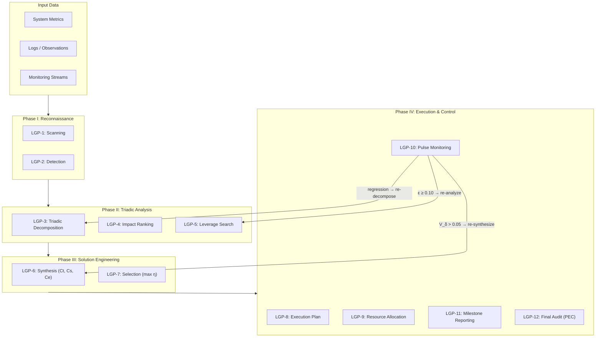

# APPENDIX LGP: THE LADY GALAXY PROTOCOL — Professional Edition

## A 12-Step Algorithmic Engine for Stability Optimization of Any System


> *"Lady Galaxy doesn't just look for a needle in a haystack. She scans the pile, analyzes the straw structure, and magnetizes the needle."*

📺 **Video: Lady Galaxy Crusade — The Explorer of Worlds:** [Watch on YouTube](https://youtu.be/25N6OKZG0T4)

---

## Protocol Architecture



---

## PART I: THE LEGEND

### The Broken Cup — A Parable of Triadic Wisdom

The story begins one morning when **Lady Galaxy — the Princess of the Universe** — wakes from dreams more beautiful than reality. Reaching toward her bedside table, she seeks her beloved cup — a gift from the Emperor, in whose crystal the galaxies are reflected.

But her hand trembles. The cup falls. And instead of life-giving liquid, only sharp shards and a shattered reality remain on the marble floor.

**Entropy has defeated beauty.**

Then, standing over the debris, Lady Galaxy asks the most important question: **"Why?"**

She calls upon the wisdom of all worlds, and the solution appears not as one, but as a **Triad**:

| Lesson | Insight | Diagnostic Question |
|--------|---------|---------------------|
| **🔷 FORM** | *"If this cup were metal — gold or platinum — it would not have broken; it would have rung."* | Is the **design/structure** adequate? |
| **🔷 POSITION** | *"Had I not placed it on the high shelf, but within easy reach, I would not have dropped it."* | Is the **context/environment** correct? |
| **🔷 ACTION** | *"Had I been focused on reality instead of wandering in dreams, my hand would not have trembled."* | Is the **process/execution** precise? |

From this morning of insight, the **Iron Law of the Explorer** is born.

---

## PART II: THE 12-STEP PROTOCOL (LGP-12)

### Mathematical Foundation

#### General U-Score (n-component system)

For a system with $n$ stability components:

$$U_{\text{score}} = \left(\prod_{i=1}^{n} u_i\right)^{1/n} = \sqrt[n]{u_1 \cdot u_2 \cdots u_n}, \quad u_i \in [0,1]$$

#### Why Geometric Mean?

| Mean | Property | Implication for stability |
|------|----------|--------------------------|
| Arithmetic $\frac{u_1 + u_2}{2}$ | Linear | $u_1=0, u_2=1 \Rightarrow 0.5$ (acceptable — **wrong!**) |
| Geometric $\sqrt{u_1 \cdot u_2}$ | Multiplicative | $u_1=0, u_2=1 \Rightarrow 0$ (unacceptable — **correct!**) |

The geometric mean **enforces balance**: one zero component collapses the entire system. This reflects the physical reality that a chain breaks at its weakest link.

#### Triadic Specialization (n = 3)

For the fundamental Triad, every system $S$ has:

$$U_{\text{triad}} = \sqrt[3]{U_F \cdot U_P \cdot U_A}$$

where:
- $U_F \in [0,1]$ — **Form stability** (structural integrity, identity coherence)
- $U_P \in [0,1]$ — **Position stability** (contextual fitness, resource availability)
- $U_A \in [0,1]$ — **Action stability** (process efficiency, energy utilization)

#### Imbalance, Instability Index, and Stability Index

**Delta (imbalance):**

$$\delta = \frac{\max(U_F, U_P, U_A) - \min(U_F, U_P, U_A)}{\max(U_F, U_P, U_A) + \epsilon}, \quad \epsilon = 0.01$$

**Instability Index** (coefficient of variation — alternative dispersion measure):

$$I_{\text{instab}} = \frac{\sigma_u}{\mu_u} = \frac{\sqrt{\frac{1}{n}\sum_{i=1}^{n}(u_i - \bar{u})^2}}{\frac{1}{n}\sum_{i=1}^{n}u_i}$$

**Stability Index (SI):**

$$SI = \frac{U_{\text{triad}}}{(1 + \delta)^2}$$

**Critical thresholds:**
- $SI > 0.618$ → **Stable** (golden ratio threshold, φ)
- $0.38 < SI < 0.618$ → **At Risk**
- $SI < 0.38$ → **Critical**
- $I_{\text{instab}} > 0.3$ → System is **unbalanced**, focus on lowest components

#### Sensitivity Analysis

How a change in one component $u_k$ affects the total U-Score:

$$\frac{\partial U_{\text{score}}}{\partial u_k} = \frac{1}{n} \cdot \frac{U_{\text{score}}}{u_k}$$

**Interpretation:** The smaller $u_k$ is, the larger the sensitivity — **fixing the weakest component yields the steepest ascent**.

#### Adjustable Triad Weights

For asymmetric systems where pillars have unequal importance:

$$w_F + w_P + w_A = 1, \quad w_F, w_P, w_A > 0$$

**Weighted U-Score:**

$$U_{\text{weighted}} = U_F^{w_F} \cdot U_P^{w_P} \cdot U_A^{w_A}$$

Default (symmetric): $w_F = w_P = w_A = \frac{1}{3}$ (reduces to standard geometric mean).

---

### PHASE I: RECONNAISSANCE (LGP 1–2)

---

#### LGP-1: SCANNING (Търсене)

**Objective:** Define system boundaries and identify the observable state.

**Procedure:**
1. Define the system $S$ and its boundary $\partial S$
2. Identify internal components $\{s_1, s_2, \ldots, s_n\}$
3. Identify external environment $E$ (everything outside $\partial S$)
4. Measure initial state vector:

$$\vec{S}_0 = (U_F^{(0)},\; U_P^{(0)},\; U_A^{(0)})$$

**Output:** System Boundary Map + Initial $\vec{S}_0$ snapshot.

---

#### LGP-2: DETECTION (Детекция — осъзнаване на проблемите)

**Objective:** Identify all instability sources (problems) affecting the system.

**Procedure:**
1. For each component $s_i$, compute local stability:

$$u_i = \sqrt[3]{u_{F,i} \cdot u_{P,i} \cdot u_{A,i}}$$

2. Detect problems as components where $u_i < \varphi = 0.618$
3. Build the **Problem Set**:

$$\mathcal{P} = \{p_1, p_2, \ldots, p_m\} \quad \text{where } p_j = s_i \text{ with } u_i < \varphi$$

4. Represent all problems as a **Problem Matrix** (each row is a problem vector in triadic space):

$$\mathbf{P} = \begin{pmatrix} f_1 & p_1 & d_1 \\ f_2 & p_2 & d_2 \\ \vdots & \vdots & \vdots \\ f_m & p_m & d_m \end{pmatrix}, \quad \vec{P}_j = (f_j, p_j, d_j) \in [0,1]^3$$

5. Compute system-level **instability contribution** of each problem:

$$w_j = \frac{\varphi - u_j}{\sum_{k=1}^{m}(\varphi - u_k)} \times 100\%$$

**Output:** Ranked Problem Registry $\mathcal{P}$ with Problem Matrix $\mathbf{P}$ and instability weights $w_j$.

---

### PHASE II: TRIADIC ANALYSIS (LGP 3–5)

---

#### LGP-3: TRIADIC DECOMPOSITION (Триадичен анализ)

**Objective:** Classify each problem into Form, Position, and Action deficits.

**Procedure:** For each problem $p_j \in \mathcal{P}$, decompose into three orthogonal deficit vectors:

$$p_j \rightarrow (d_{F,j},\; d_{P,j},\; d_{A,j})$$

where:
- $d_{F,j} = \max(0,\; \varphi - u_{F,j})$ — **Form deficit** (structural/identity gap)
- $d_{P,j} = \max(0,\; \varphi - u_{P,j})$ — **Position deficit** (context/resource gap)
- $d_{A,j} = \max(0,\; \varphi - u_{A,j})$ — **Action deficit** (process/energy gap)

**Weighted Projection** (when pillars have unequal importance):

$$\mathbf{D}_w = \mathbf{D} \cdot \mathbf{W}, \quad \mathbf{W} = \text{diag}(w_F, w_P, w_A)$$

where $\mathbf{D}$ is the deficit matrix and $w_F + w_P + w_A = 1$.

**Classify** the dominant deficit for each problem:

$$\text{DominantAxis}(p_j) = \arg\max(d_{F,j},\; d_{P,j},\; d_{A,j})$$

**Aggregate** into three groups:

| Group | Problems | Total Deficit Mass |
|-------|----------|-------------------|
| $\mathcal{P}_F$ | Problems dominated by Form deficit | $D_F = \sum_{j \in \mathcal{P}_F} d_{F,j}$ |
| $\mathcal{P}_P$ | Problems dominated by Position deficit | $D_P = \sum_{j \in \mathcal{P}_P} d_{P,j}$ |
| $\mathcal{P}_A$ | Problems dominated by Action deficit | $D_A = \sum_{j \in \mathcal{P}_A} d_{A,j}$ |

**The Weakest Pillar:**

$$\text{WeakestPillar} = \arg\max(D_F, D_P, D_A)$$

**Triadic Purity** — not all problems decompose cleanly into F/P/A. Measure how "pure" the classification is:

$$\chi_j = 1 - \frac{\|\vec{\delta}_j^{\perp}\|}{\|\vec{\delta}_j\|} \in [0,1]$$

where $\vec{\delta}_j^{\perp}$ is the residual after projecting onto the dominant axis only (i.e., $\vec{\delta}_j - \text{DominantAxis component}$).

| $\chi_j$ | Interpretation | Action |
|----------|---------------|--------|
| $\chi_j > 0.85$ | Pure single-pillar problem | Standard LGP-4 ranking |
| $0.50 < \chi_j < 0.85$ | Cross-pillar problem | Address dominant + secondary axis |
| $\chi_j < 0.50$ | Deeply entangled problem | Requires systemic (not axis-targeted) solution |

**Output:** Triadic Deficit Map + Pillar Classification + Weakest Pillar identification + Purity scores $\chi_j$.

---

#### LGP-4: IMPACT RANKING (Избор на най-значимите проблеми)

**Objective:** Rank problems by their percentage contribution to total system instability.

**Procedure:**
1. Compute the **instability impact** of each problem on the system U-Score. Because $U_{\text{triad}}$ is a geometric mean, a deficit on the weakest axis has disproportionate impact:

$$\text{Impact}(p_j) = U_{\text{triad}}^{(\text{without } p_j)} - U_{\text{triad}}^{(\text{current})}$$

This measures how much $U_{\text{triad}}$ would rise if problem $p_j$ were fully resolved.

2. **Pareto ranking** — sort problems by Impact descending:

$$p_{(1)} \geq p_{(2)} \geq \ldots \geq p_{(m)}$$

3. **Expected improvement** from resolving problem $p_j$ (corrected for geometric mean sensitivity):

$$\mathbb{E}[\Delta U_j] = U_{\text{triad}} \cdot \left(\sqrt[3]{\frac{\varphi}{u_{\min}^{(j)}}} - 1\right)$$

where $u_{\min}^{(j)}$ is the weakest component linked to problem $p_j$. This reflects the cube-root nonlinearity — larger gains from fixing deeper deficits.

4. **Percentage contribution** to total instability:

$$\rho_j = \frac{\mathbb{E}[\Delta U_j]}{\sum_{k=1}^{m} \mathbb{E}[\Delta U_k]} \times 100\%$$

5. Find the **Pareto-80 set** — the smallest set of problems generating ≥80% of total instability:

$$\mathcal{P}_{80} = \{p_{(1)}, \ldots, p_{(k)}\} \quad \text{such that } \sum_{i=1}^{k} \text{Impact}(p_{(i)}) \geq 0.80 \cdot \sum_{i=1}^{m} \text{Impact}(p_{(i)})$$

**Output:** Pareto-ranked Problem List + $\mathcal{P}_{80}$ target set.

---

#### LGP-5: LEVERAGE SEARCH (Търсене на лостове)

**Objective:** Among the top problems, find those whose resolution yields maximum U-Score gain, considering the geometric mean sensitivity.

**Key insight:** Because $U_{\text{triad}} = \sqrt[3]{U_F \cdot U_P \cdot U_A}$, improving the **weakest pillar** yields the highest marginal gain. The partial derivative confirms this:

$$\frac{\partial U_{\text{triad}}}{\partial U_X} = \frac{1}{3} \cdot \frac{U_{\text{triad}}}{U_X}$$

The smaller $U_X$ is, the larger the derivative → **fixing the weakest axis gives the steepest ascent**.

**Procedure:**
1. For each $p_j \in \mathcal{P}_{80}$, estimate the **Leverage Score**:

$$L_j = \frac{\Delta U_{\text{triad}}^{(j)}}{\text{Cost}(p_j)}$$

where $\Delta U_{\text{triad}}^{(j)}$ is the projected U-Score gain from solving $p_j$, and $\text{Cost}(p_j)$ is computed in LGP-6.

2. Problems on the **Weakest Pillar** get a natural priority multiplier because $\partial U_{\text{triad}} / \partial U_{\text{weakest}}$ is largest.

3. Rank by $L_j$ descending → **High-Leverage Problem Set** $\mathcal{P}^*$.

**Output:** Leverage-ranked priorities $\mathcal{P}^*$ — the problems that "move the needle" most per unit of resource spent.

---

### PHASE III: SOLUTION ENGINEERING (LGP 6–7)

---

#### LGP-6: SOLUTION SYNTHESIS (Синтез на решения)

**Objective:** For each priority problem, generate candidate solutions and compute their **triadic cost**.

**Procedure:** For each $p_j \in \mathcal{P}^*$, generate candidate solutions $\{r_{j,1}, r_{j,2}, \ldots, r_{j,q}\}$.

**Every solution has three costs** (the "Three Prices of the Universe"):

| Cost | Symbol | Dimension | What It Measures |
|------|--------|-----------|-----------------|
| **Time Cost** | $C_T(r)$ | Form (pays Time) | How long does the solution take to implement? Complexity of design. |
| **Space Cost** | $C_S(r)$ | Position (pays Space) | How much context/resources/infrastructure does it consume? |
| **Energy Cost** | $C_E(r)$ | Action (pays Energy) | How much energy/effort/compute does execution require? |

**Triadic Cost** of a solution:

$$\text{Cost}_{\text{triad}}(r) = \sqrt[3]{C_T(r) \cdot C_S(r) \cdot C_E(r)}$$

**Min-Max Normalization** (to enable cross-solution comparison):

$$\hat{C}_T(r) = \frac{C_T(r) - C_T^{\min}}{C_T^{\max} - C_T^{\min}}, \quad \hat{C}_S(r) = \frac{C_S(r) - C_S^{\min}}{C_S^{\max} - C_S^{\min}}, \quad \hat{C}_E(r) = \frac{C_E(r) - C_E^{\min}}{C_E^{\max} - C_E^{\min}}$$

All normalized costs $\hat{C}_X \in [0,1]$.

**Projected benefit:**

$$\text{Benefit}(r) = U_{\text{triad}}^{(\text{after } r)} - U_{\text{triad}}^{(\text{before})}$$

**Resource Entropy** — measures how balanced the cost profile is across dimensions:

$$S_C(r) = -\sum_{X \in \{T,S,E\}} \frac{C_X}{\sum_Y C_Y} \ln\left(\frac{C_X}{\sum_Y C_Y}\right)$$

| $S_C$ | Interpretation |
|-------|---------------|
| $S_C \approx \ln 3 = 1.10$ | Perfectly balanced cost (equal T/S/E) |
| $S_C \approx 0.5$ | Moderately concentrated |
| $S_C \approx 0$ | All cost in one dimension (risky — creates resource bottleneck) |

Solutions with extremely low $S_C$ should be flagged — they create single-resource dependencies.

**Output:** Solution Matrix — for each problem, a table of candidate solutions with $(C_T, C_S, C_E, \text{Benefit}, S_C)$.

---

#### LGP-7: SOLUTION SELECTION (Селекция)

**Objective:** Select optimal solutions considering cost constraints and strategic priorities.

**Procedure:**
1. Define **priority weights** based on which cost the system can best afford:

$$\vec{w} = (\alpha, \beta, \gamma), \quad \alpha + \beta + \gamma = 1$$

where:
- $\alpha$ = willingness to pay **Time** (patience for slow but thorough solutions)
- $\beta$ = willingness to pay **Space** (budget for resources/infrastructure)
- $\gamma$ = willingness to pay **Energy** (capacity for effort/compute)

2. Compute **Weighted Cost** for each solution:

$$C_w(r) = \alpha \cdot \hat{C}_T(r) + \beta \cdot \hat{C}_S(r) + \gamma \cdot \hat{C}_E(r)$$

where $\hat{C}_X$ are normalized costs $\in [0,1]$.

3. Compute **Solution Efficiency Index**:

$$\eta(r) = \frac{\text{Benefit}(r)}{C_w(r)}$$

4. Select solutions with maximum $\eta$:

$$r_j^* = \arg\max_{r \in \{r_{j,1}, \ldots, r_{j,q}\}} \eta(r)$$

5. **Budget constraint check**: Ensure total selected costs don't exceed available resources:

$$\sum_j C_w(r_j^*) \leq B_{\text{available}}$$

If exceeded, drop lowest-$\eta$ solutions until feasible.

**Output:** Selected Solution Set $\mathcal{R}^* = \{r_1^*, r_2^*, \ldots\}$ with expected total $\Delta U_{\text{triad}}$.

---

### PHASE IV: EXECUTION & CONTROL (LGP 8–12)

---

#### LGP-8: EXECUTION PLAN (Съставяне на план)

**Objective:** Create a sequenced action plan with milestones and expected U-Score trajectory.

**Procedure:**
1. Build **Task Dependency Graph** $G = (V, E)$ where vertices are solutions and edges are dependencies
2. Apply **topological sort** to determine valid execution ordering:

$$\text{order} = \text{topological\_sort}(G)$$

3. Within each dependency level, sequence by priority (highest $\eta$ first)
4. Define **milestones** $M_1, M_2, \ldots, M_k$ with:
   - Expected completion criteria
   - Expected $U_{\text{triad}}$ at milestone
   - Resource budget for milestone
5. Compute **planned trajectory**:

$$U_{\text{planned}}(t) = U_{\text{triad}}^{(0)} + \sum_{i : t_i \leq t} \Delta U_i$$

6. Define **minimum acceptable slope**:

$$\dot{U}_{\min} = \frac{U_{\text{target}} - U_{\text{triad}}^{(0)}}{T_{\text{total}}}$$

7. **Stochastic scheduling (PERT)** — when task durations are uncertain, model each task with three estimates:

$$T_v \sim \text{Beta}(a_v, b_v, c_v) \quad \text{(optimistic, most likely, pessimistic)}$$

**Critical Path** — the longest path through the dependency graph:

$$CP = \arg\max_{\text{paths } P} \sum_{v \in P} \mathbb{E}[T_v]$$

**Probability of on-time completion:**

$$P(T_{\text{total}} \leq T_{\text{deadline}}) = \Phi\left(\frac{T_{\text{deadline}} - \mu_{CP}}{\sigma_{CP}}\right)$$

where $\mu_{CP} = \sum_{v \in CP} \mathbb{E}[T_v]$ and $\sigma_{CP}^2 = \sum_{v \in CP} \text{Var}(T_v)$.

**Output:** Gantt-style execution plan + planned U-Score trajectory curve + critical path + completion probability.

---

#### LGP-9: RESOURCE ALLOCATION (Осигуряване на ресурси)

**Objective:** Secure and allocate resources across the three cost dimensions.

**Procedure:**
1. **Resource Inventory** — catalog available resources by type:

| Resource Type | Available | Required | Gap |
|---------------|-----------|----------|-----|
| Time ($R_T$) | $R_T^{\text{avail}}$ | $\sum_j C_T(r_j^*)$ | $\Delta R_T$ |
| Space ($R_S$) | $R_S^{\text{avail}}$ | $\sum_j C_S(r_j^*)$ | $\Delta R_S$ |
| Energy ($R_E$) | $R_E^{\text{avail}}$ | $\sum_j C_E(r_j^*)$ | $\Delta R_E$ |

2. If gaps exist ($\Delta R_X > 0$), either:
   - Acquire additional resources
   - Reduce scope (drop lowest-$\eta$ solutions)
   - Substitute (trade time for energy, etc.)

3. **Resource allocation per milestone:**

$$\vec{R}(M_i) = (R_T^{(i)}, R_S^{(i)}, R_E^{(i)})$$

**Output:** Resource Allocation Table + Gap Analysis.

---

#### LGP-10: PULSE MONITORING (Мониторинг по време на изпълнение)

**Objective:** Continuously monitor $U_{\text{triad}}$ during execution and apply corrective action.

**Procedure:**
1. At each checkpoint $t_c$, measure actual system state:

$$\vec{S}(t_c) = (U_F(t_c),\; U_P(t_c),\; U_A(t_c))$$

2. Compute **trajectory deviation**:

$$\varepsilon(t_c) = U_{\text{planned}}(t_c) - U_{\text{actual}}(t_c)$$

3. **Correction rules:**

| Condition | Interpretation | Action |
|-----------|---------------|--------|
| $\varepsilon < 0.02$ | On track | Continue |
| $0.02 \leq \varepsilon < 0.10$ | Minor deviation | Adjust priorities within current milestone |
| $\varepsilon \geq 0.10$ | Major deviation | **Re-enter LGP-5** — re-analyze leverage, possibly re-sequence |
| $U_{\text{actual}}(t_c) < U_{\text{actual}}(t_{c-1})$ | Regression | **Emergency stop** — current solution is harmful, revert and re-enter LGP-3 |

4. Compute **δ-volatility** to detect hidden instability:

$$V_\delta(t_c) = \text{Var}(\delta_{t_{c-k}}, \ldots, \delta_{t_c})$$

If $V_\delta > 0.05$, the system is oscillating — solutions are fighting each other → re-enter LGP-6.

**Output:** U-Score Time Series + Deviation Reports + Correction Decisions.

---

#### LGP-11: MILESTONE REPORTING (Отчитане на етапи)

**Objective:** Document progress at each milestone with quantitative metrics.

**Procedure:** At each milestone $M_i$, produce a **Milestone Card**:

| Field | Content |
|-------|---------|
| Milestone ID | $M_i$ |
| Problems Addressed | $\{p_j\}$ attempted in this phase |
| Solutions Executed | $\{r_j^*\}$ applied |
| $U_{\text{triad}}$ before | $U_{\text{triad}}(t_{i-1})$ |
| $U_{\text{triad}}$ after | $U_{\text{triad}}(t_i)$ |
| $\Delta U$ achieved | $U_{\text{triad}}(t_i) - U_{\text{triad}}(t_{i-1})$ |
| $\Delta U$ planned | $U_{\text{planned}}(t_i) - U_{\text{planned}}(t_{i-1})$ |
| Efficiency ratio | $\Delta U_{\text{actual}} / \Delta U_{\text{planned}}$ |
| Resources spent | $(C_T^{\text{spent}}, C_S^{\text{spent}}, C_E^{\text{spent}})$ |
| SI status | Stable / At Risk / Critical |
| $\delta$ trend | ↑ / → / ↓ |
| Next actions | Continue / Adjust / Re-plan |

**Output:** Milestone Cards archive.

---

#### LGP-12: FINAL AUDIT (Цялостен отчет)

**Objective:** Comprehensive evaluation of the entire intervention cycle.

**Procedure:**

1. **Compute Total Stability Gain:**

$$\Delta U_{\text{total}} = U_{\text{triad}}^{(\text{final})} - U_{\text{triad}}^{(0)}$$

$$\Delta SI_{\text{total}} = SI^{(\text{final})} - SI^{(0)}$$

2. **Compute Total Resource Expenditure:**

$$\vec{C}_{\text{total}} = \left(\sum_j C_T^{\text{spent}}, \sum_j C_S^{\text{spent}}, \sum_j C_E^{\text{spent}}\right)$$

$$C_{\text{triad}}^{\text{total}} = \sqrt[3]{C_{T}^{\text{total}} \cdot C_{S}^{\text{total}} \cdot C_{E}^{\text{total}}}$$

3. **Protocol Efficiency Coefficient (PEC):**

$$\text{PEC} = \frac{\Delta U_{\text{total}}}{C_{\text{triad}}^{\text{total}}}$$

Interpretation: How much stability gain per unit of triadic cost.

4. **Per-Pillar Audit:**

| Pillar | $U_X^{(0)}$ | $U_X^{(\text{final})}$ | $\Delta U_X$ | Resources Spent | Efficiency |
|--------|-------------|----------------------|-------------|-----------------|------------|
| Form | | | | | $\Delta U_F / C_F$ |
| Position | | | | | $\Delta U_P / C_P$ |
| Action | | | | | $\Delta U_A / C_A$ |

5. **Balance Assessment:**

$$\delta^{(0)} \rightarrow \delta^{(\text{final})}$$

Did the intervention **reduce imbalance**? If $\delta^{(\text{final})} < \delta^{(0)}$, the system is more balanced.

6. **Lessons Learned:**
   - Which leverage predictions were accurate?
   - Which solutions exceeded/underperformed expectations?
   - Update baseline for next LGP cycle.

7. **Cumulative Efficiency and ROI:**

$$U_{\text{final}} = U_{\text{initial}} + \sum_{i=1}^{k} \Delta U(r_i^*)$$

$$\text{ROI}_{\text{plan}} = \frac{U_{\text{final}} - U_{\text{initial}}}{\text{Cost}_{\text{total}}}$$

**Output:** Final Audit Report — the permanent record of the intervention.

---

### Example Tracking Table

| Problem | Triad $(f, p, a)$ | $\rho$ (%) | $\Delta U$ | Solution | $\hat{C}_T$ | $\hat{C}_S$ | $\hat{C}_E$ | $C_w$ | $\eta$ |
|---------|-------------------|------------|------------|----------|------|------|------|---------|------|
| $P_1$ | (0.80, 0.20, 0.50) | 35% | +0.15 | $r_1^*$ | 0.3 | 0.4 | 0.2 | 0.30 | 0.50 |
| $P_2$ | (0.30, 0.70, 0.40) | 28% | +0.12 | $r_2^*$ | 0.5 | 0.1 | 0.3 | 0.30 | 0.40 |
| $P_3$ | (0.60, 0.50, 0.90) | 22% | +0.09 | $r_3^*$ | 0.2 | 0.6 | 0.1 | 0.30 | 0.30 |
| **Total** | | **85%** | **+0.36** | | | | | **0.90** | **0.40** |

**Reading the table:**
- $P_1$ has the weakest Position (0.20) → dominant deficit is Position → highest priority
- $P_2$ has the weakest Form (0.30) → structural problem
- $P_3$ has Action as its strongest pillar (0.90 > φ) with only a small Position deficit → lowest priority
- All three cost the same $C_w = 0.30$ but $P_1$ delivers the most $\Delta U$ → highest $\eta$

---

## PART III: THE PROTOCOL SUMMARY CARD

| Element | Description |
|---------|-------------|
| **Name** | Lady Galaxy Protocol — Professional Edition (LGP-12) |
| **Purpose** | Transform any system's stability through algorithmic triadic optimization |
| **Core Equation** | $U_{\text{triad}} = \sqrt[3]{U_F \cdot U_P \cdot U_A}$ |
| **Stability Index** | $SI = U_{\text{triad}} / (1 + \delta)^2$ |
| **Phases** | I. Reconnaissance (1-2) → II. Triadic Analysis (3-5) → III. Solution Engineering (6-7) → IV. Execution & Control (8-12) |
| **Selection Criterion** | $\eta(r) = \text{Benefit}(r) / C_w(r)$ — maximize stability gain per weighted cost |
| **Monitoring** | Pulse checks with $\varepsilon$-deviation and $V_\delta$-volatility triggers |
| **Validation** | $U_{\text{triad}}^{(\text{final})} > U_{\text{triad}}^{(0)}$ AND $\delta^{(\text{final})} < \delta^{(0)}$ |
| **Audit** | PEC = $\Delta U_{\text{total}} / C_{\text{triad}}^{\text{total}}$ |

---

## PART IV: THE RESEARCHER'S VOW

A protocol is more than an algorithm. It is a **journey of the spirit**.

🎵 **THE BEGINNING ("Crusade"):** When we begin, we are like knights. Lady Galaxy greets us with the song "[Crusade](https://youtu.be/25N6OKZG0T4)" — a call to battle against chaos. We set out to fix the world.

🐟 **THE BATTLE (Against the Current):** When the going gets tough, when the "cup breaks" over and over again, we remember that we are like fish in the delta of a great river. The current of entropy pushes us back. Death is probable. But we swim against the current with our last strength. **Why?** To spawn — to release the Light of Science. So that the next generation can start from where we left off.

🎵 **THE END ("Mortal"):** When we finish, successfully or not, Lady Galaxy sends us off with "[Mortal](https://youtu.be/TuoGHCB3xtk)". For although our bodies are perishable and "break like a cup on the floor," our work, encoded in the Protocol, remains eternal.

> ***We are mortal. But what we create through the Triad is immortal.***

---

## PART V: VISUAL PROTOCOL FLOW

```
┌─────────────────────────────────────────────────────────────────────┐
│                    LADY GALAXY PROTOCOL (LGP-12)                    │
├─────────────────────────────────────────────────────────────────────┤
│                                                                     │
│  PHASE I: RECONNAISSANCE                                           │
│  ┌──────────┐    ┌──────────┐                                      │
│  │ LGP-1    │───▶│ LGP-2    │                                      │
│  │ SCANNING │    │ DETECTION│                                      │
│  │ Define S │    │ Find P   │                                      │
│  └──────────┘    └────┬─────┘                                      │
│                       │                                             │
│  PHASE II: TRIADIC ANALYSIS                                        │
│  ┌──────────┐    ┌──────────┐    ┌──────────┐                      │
│  │ LGP-3    │───▶│ LGP-4    │───▶│ LGP-5    │                      │
│  │ DECOMPOSE│    │ IMPACT   │    │ LEVERAGE │                      │
│  │ F / P / A│    │ RANK     │    │ SEARCH   │                      │
│  └──────────┘    └──────────┘    └────┬─────┘                      │
│                                       │                             │
│  PHASE III: SOLUTION ENGINEERING                                    │
│  ┌──────────┐    ┌──────────┐                                      │
│  │ LGP-6    │───▶│ LGP-7    │                                      │
│  │ SYNTHESIS│    │ SELECTION│                                      │
│  │ Ct/Cs/Ce │    │ max η(r) │                                      │
│  └──────────┘    └────┬─────┘                                      │
│                       │                                             │
│  PHASE IV: EXECUTION & CONTROL                                     │
│  ┌──────────┐    ┌──────────┐    ┌──────────┐                      │
│  │ LGP-8    │───▶│ LGP-9    │───▶│ LGP-10   │◀─── FEEDBACK LOOP   │
│  │ PLAN     │    │ RESOURCE │    │ PULSE    │                      │
│  │ Mileston.│    │ ALLOCATE │    │ MONITOR  │──┐                   │
│  └──────────┘    └──────────┘    └────┬─────┘  │ if ε ≥ 0.10      │
│                                       │         │ → back to LGP-5  │
│  ┌──────────┐    ┌──────────┐         │         │                   │
│  │ LGP-11   │───▶│ LGP-12   │         │         │                   │
│  │ MILESTONE│    │ FINAL    │◀────────┘         │                   │
│  │ REPORT   │    │ AUDIT    │                   │                   │
│  └──────────┘    └──────────┘                   │                   │
│                       │                          │                   │
│                       ▼                          │                   │
│               ┌──────────────┐                   │                   │
│               │ PEC = ΔU/C   │                   │                   │
│               │ Protocol     │                   │                   │
│               │ Efficiency   │◀──────────────────┘                   │
│               └──────────────┘                                      │
│                                                                     │
└─────────────────────────────────────────────────────────────────────┘
```

---

## APPENDIX LGP-A: KEY MATHEMATICAL FORMULAS

| # | Formula | Purpose |
|---|---------|---------|
| 1 | $U_{\text{score}} = (\prod u_i)^{1/n}$ | General system stability (n components) |
| 2 | $U_{\text{triad}} = \sqrt[3]{U_F \cdot U_P \cdot U_A}$ | Triadic stability (n=3 specialization) |
| 3 | $U_{\text{weighted}} = U_F^{w_F} \cdot U_P^{w_P} \cdot U_A^{w_A}$ | Weighted stability (asymmetric systems) |
| 4 | $\delta = \frac{\max(U) - \min(U)}{\max(U) + 0.01}$ | Triad imbalance |
| 5 | $I_{\text{instab}} = \sigma_u / \mu_u$ | Instability index (coefficient of variation) |
| 6 | $SI = \frac{U_{\text{triad}}}{(1+\delta)^2}$ | Stability Index (penalizes imbalance) |
| 7 | $\frac{\partial U_{\text{score}}}{\partial u_k} = \frac{U_{\text{score}}}{n \cdot u_k}$ | Sensitivity (weakest axis = steepest ascent) |
| 8 | $d_{X,j} = \max(0, \varphi - u_{X,j})$ | Deficit on axis X for problem j |
| 9 | $\mathbb{E}[\Delta U_j] = U_{\text{triad}} \cdot (\sqrt[3]{\varphi/u_{\min}^{(j)}} - 1)$ | Expected improvement from solving problem j |
| 10 | $\rho_j = \mathbb{E}[\Delta U_j] / \sum \mathbb{E}[\Delta U_k] \times 100\%$ | Problem instability contribution (%) |
| 11 | $\text{Cost}_{\text{triad}}(r) = \sqrt[3]{C_T \cdot C_S \cdot C_E}$ | Triadic cost of a solution |
| 12 | $\hat{C}_X = (C_X - C_X^{\min})/(C_X^{\max} - C_X^{\min})$ | Min-max cost normalization |
| 13 | $C_w(r) = \alpha \hat{C}_T + \beta \hat{C}_S + \gamma \hat{C}_E$ | Weighted cost ($\alpha+\beta+\gamma=1$) |
| 14 | $\eta(r) = \Delta U_{\text{triad}} / C_w(r)$ | Solution efficiency index |
| 15 | $\varepsilon(t) = U_{\text{planned}}(t) - U_{\text{actual}}(t)$ | Trajectory deviation |
| 16 | $V_\delta(t) = \text{Var}(\delta_{t-k}, \ldots, \delta_t)$ | δ-volatility (oscillation detector) |
| 17 | $\text{PEC} = \Delta U_{\text{total}} / C_{\text{triad}}^{\text{total}}$ | Protocol Efficiency Coefficient |
| 18 | $\text{ROI} = (U_{\text{final}} - U_{\text{initial}}) / \text{Cost}_{\text{total}}$ | Return on Investment |

---

## APPENDIX LGP-B: FORMAL PROTOCOL PSEUDOCODE

```
┌─────────────────────────────────────────────────────────────────────┐
│                  LGP PROTOCOL — MATHEMATICAL SUMMARY                │
├─────────────────────────────────────────────────────────────────────┤
│                                                                     │
│  PHASE I: RECONNAISSANCE                                           │
│  ─────────────────                                                  │
│  LGP-1 Scanning:                                                    │
│      S = {s₁, s₂, ..., sₙ} → System component set                 │
│      S⃗₀ = (U_F⁰, U_P⁰, U_A⁰) → Initial state vector              │
│                                                                     │
│  LGP-2 Detection:                                                   │
│      ∀sᵢ: uᵢ = ∛(u_F,i · u_P,i · u_A,i)                           │
│      P = {pⱼ | uⱼ < φ = 0.618}                                     │
│      P = [f₁ p₁ d₁; f₂ p₂ d₂; ...; fₘ pₘ dₘ] → Problem Matrix    │
│      wⱼ = (φ - uⱼ) / Σ(φ - uₖ) × 100%                            │
│                                                                     │
├─────────────────────────────────────────────────────────────────────┤
│                                                                     │
│  PHASE II: TRIADIC ANALYSIS                                         │
│  ─────────────────                                                  │
│  LGP-3 Decomposition:                                               │
│      ∀pⱼ → (d_F,j, d_P,j, d_A,j) where d_X = max(0, φ - u_X)     │
│      D_w = D · diag(w_F, w_P, w_A) → Weighted deficit matrix       │
│      WeakestPillar = argmax(D_F, D_P, D_A)                         │
│                                                                     │
│  LGP-4 Impact Ranking:                                              │
│      E[ΔUⱼ] = U_triad · (∛(φ/u_min^(j)) - 1)                      │
│      ρⱼ = E[ΔUⱼ] / ΣE[ΔUₖ] × 100%                                │
│      P₈₀ = smallest set with Σρ ≥ 80%                              │
│                                                                     │
│  LGP-5 Leverage Search:                                             │
│      Lⱼ = ΔU_triad^(j) / Cost(pⱼ)                                  │
│      ∂U/∂U_X = U_triad/(3·U_X) → weakest axis = steepest           │
│      P* = sort(P₈₀, L) descending                                   │
│                                                                     │
├─────────────────────────────────────────────────────────────────────┤
│                                                                     │
│  PHASE III: SOLUTION ENGINEERING                                    │
│  ─────────────────                                                  │
│  LGP-6 Synthesis:                                                   │
│      ∀pⱼ ∈ P*: generate {r_j,1 ... r_j,q}                          │
│      ∀r: C⃗(r) = (C_T, C_S, C_E)                                    │
│      Ĉ_X = (C_X - C_X^min)/(C_X^max - C_X^min) ∈ [0,1]            │
│      Cost_triad(r) = ∛(C_T · C_S · C_E)                            │
│                                                                     │
│  LGP-7 Selection:                                                   │
│      C_w(r) = α·Ĉ_T + β·Ĉ_S + γ·Ĉ_E, α+β+γ=1                    │
│      η(r) = Benefit(r) / C_w(r)                                     │
│      r*ⱼ = argmax_r η(r) subject to Σ C_w ≤ Budget                 │
│                                                                     │
├─────────────────────────────────────────────────────────────────────┤
│                                                                     │
│  PHASE IV: EXECUTION & CONTROL                                     │
│  ─────────────────                                                  │
│  LGP-8 Planning:                                                    │
│      G = (V, E) → Task dependency graph                             │
│      order = topological_sort(G)                                    │
│      U_planned(t) = U⁰ + Σ ΔUᵢ for tᵢ ≤ t                         │
│                                                                     │
│  LGP-9 Resources:                                                   │
│      R⃗(Mᵢ) = (R_T^(i), R_S^(i), R_E^(i))                          │
│      ΔR_X = Σ C_X(r*) - R_X^avail → Gap analysis                   │
│                                                                     │
│  LGP-10 Pulse Monitoring:                                           │
│      ε(t) = U_planned(t) - U_actual(t)                              │
│      V_δ(t) = Var(δ_{t-k}...δ_t)                                   │
│      if ε < 0.02: continue                                          │
│      if 0.02 ≤ ε < 0.10: adjust within milestone                   │
│      if ε ≥ 0.10: → re-enter LGP-5                                 │
│      if U_actual(t) < U_actual(t-1): EMERGENCY → LGP-3             │
│      if V_δ > 0.05: oscillation detected → LGP-6                   │
│                                                                     │
│  LGP-11 Milestone Reporting:                                        │
│      Milestone Card: (M_i, ΔU_actual, ΔU_planned, C_spent, SI, δ)  │
│                                                                     │
│  LGP-12 Final Audit:                                                │
│      PEC = ΔU_total / C_triad^total                                 │
│      ROI = (U_final - U_initial) / Cost_total                       │
│      Balance: δ⁰ → δ_final (must decrease)                         │
│                                                                     │
└─────────────────────────────────────────────────────────────────────┘
```

---

---

## APPENDIX LGP-C: AI APPLICATION — TRIADIC OPTIMIZATION OF AI SYSTEMS

> *"Current AI is a giant with one leg — massive Action (compute), but crippled Form (no self-model) and blind Position (no grounding). The Triad can fix this."*

---

### C.1: AI SYSTEM TRIADIC MAPPING

Every AI system maps naturally onto the three pillars:

$$U_{AI} = \sqrt[3]{U_{\text{Form}} \cdot U_{\text{Position}} \cdot U_{\text{Action}}}$$

| Pillar | AI Meaning | Components |
|--------|-----------|------------|
| **$U_F$ (Form)** | Architecture, parameters, structural integrity | Layer design, attention heads, weight distribution, output coherence, hallucination rate |
| **$U_P$ (Position)** | Context, data, environment | Training data quality, RAG context, system prompts, knowledge freshness, bias/fairness |
| **$U_A$ (Action)** | Inference, execution, energy | Latency, throughput, tool execution, GPU utilization, error rate |

```
┌─────────────────────────────────────────────────────────────────────┐
│                    AI SYSTEM TRIADIC MAP                            │
├─────────────────────────────────────────────────────────────────────┤
│                                                                     │
│  U_Form (Model Quality)              U_Position (Context Quality)   │
│  ├── Architecture                    ├── Training Data              │
│  │   ├── Layer count & type          │   ├── Quality & completeness │
│  │   ├── Attention mechanism         │   ├── Bias & fairness        │
│  │   └── Embedding dimensions        │   └── Freshness & relevance  │
│  ├── Parameter Quality               ├── Inference Context          │
│  │   ├── Weight distribution         │   ├── RAG retrieval quality  │
│  │   ├── Gradient flow               │   ├── System prompt effect.  │
│  │   └── Convergence state           │   └── History management     │
│  └── Output Coherence                └── Environment                │
│      ├── Consistency score               ├── Hardware availability  │
│      ├── Hallucination rate              └── API rate limits        │
│      └── Factual accuracy                                           │
│                                                                     │
│  U_Action (Performance Quality)                                     │
│  ├── Inference: Latency, Throughput, First-token time               │
│  ├── Resources: GPU memory, CPU utilization, Energy                 │
│  └── Execution: Tool accuracy, Format compliance, Error rate        │
│                                                                     │
└─────────────────────────────────────────────────────────────────────┘
```

---

### C.2: AI PROBLEM TAXONOMY (15 Classified Deficits)

Each AI problem is a vector in triadic space: $\vec{AI}_j = (f_j, p_j, a_j) \in [0,1]^3$

#### Form Deficits ($\mathcal{P}_F^{AI}$)

| Problem | Symbol | Detection Criterion |
|---------|--------|---------------------|
| **Overfitting** | $f_{\text{over}}$ | $E_{\text{train}} - E_{\text{val}} > \theta$ |
| **Underfitting** | $f_{\text{under}}$ | $E_{\text{train}} > \theta_{\text{high}}$ |
| **Model Collapse** | $f_{\text{col}}$ | $U_F^{(t)} < U_F^{(t-1)}$ (quality regression) |
| **Hallucination** | $f_{\text{hall}}$ | Factuality $< 0.7$ |
| **Catastrophic Forgetting** | $f_{\text{forg}}$ | $\Delta \text{accuracy}_{\text{old}} > 0.1$ |

#### Position Deficits ($\mathcal{P}_P^{AI}$)

| Problem | Symbol | Detection Criterion |
|---------|--------|---------------------|
| **Data Drift** | $p_{\text{drift}}$ | $D_{KL}(P_{\text{train}} \| P_{\text{real}}) > \theta$ |
| **Context Overflow** | $p_{\text{ctx}}$ | tokens $>$ max_context |
| **RAG Degradation** | $p_{\text{rag}}$ | Recall@K $< 0.5$ |
| **Prompt Injection** | $p_{\text{inj}}$ | Injection_detected = true |
| **Knowledge Cutoff** | $p_{\text{cut}}$ | age_knowledge $>$ threshold |

#### Action Deficits ($\mathcal{P}_A^{AI}$)

| Problem | Symbol | Detection Criterion |
|---------|--------|---------------------|
| **Latency Spike** | $a_{\text{lat}}$ | $P99_{\text{latency}} > 2 \times \text{target}$ |
| **Throughput Drop** | $a_{\text{tp}}$ | tokens/sec $< 0.5 \times \text{baseline}$ |
| **Resource Exhaustion** | $a_{\text{mem}}$ | GPU_memory $> 95\%$ |
| **API Failures** | $a_{\text{api}}$ | Error_rate $> 1\%$ |
| **Tool Failure** | $a_{\text{tool}}$ | Success_rate $< 0.9$ |

#### Example AI Problem Matrix

```python
AI_Problems = {
    "Hallucination":      (0.85, 0.10, 0.05),  # Form-dominated
    "High_Latency":       (0.05, 0.15, 0.80),  # Action-dominated
    "Data_Drift":         (0.20, 0.75, 0.05),  # Position-dominated
    "Context_Overflow":   (0.10, 0.80, 0.10),  # Position-dominated
    "Memory_Exhaustion":  (0.05, 0.20, 0.75),  # Action-dominated
    "RAG_Degradation":    (0.15, 0.70, 0.15),  # Position-dominated
    "Output_Incoherence": (0.60, 0.30, 0.10),  # Form-dominated
    "Tool_Failure":       (0.10, 0.10, 0.80),  # Action-dominated
}
```

---

### C.3: AI-SPECIFIC METRICS

Each pillar decomposes into a triadic sub-score (recursive application of the protocol):

#### $U_F^{AI}$ — Model Quality

$$U_F^{AI} = \sqrt[3]{Q_{\text{accuracy}} \cdot Q_{\text{coherence}} \cdot Q_{\text{structure}}}$$

| Metric | Formula | Threshold |
|--------|---------|-----------|
| $Q_{\text{acc}}$ | $\frac{1}{K}\sum_{k=1}^{K} \text{metric}_k$ (avg benchmark scores) | $> 0.8$ |
| $Q_{\text{coh}}$ | $1 - H_{\text{rate}}$ (1 minus hallucination rate) | $> 0.7$ |
| $Q_{\text{str}}$ | $1 - |\text{weight\_norm} - 1.0|$ (weight health) | $> 0.8$ |

**Factuality decomposition.** When $Q_{\text{acc}}$ is below threshold, decompose into four sub-metrics to identify *what kind* of factual errors dominate:

$$Q_{\text{acc}} = w_1 \cdot F_{\text{entity}} + w_2 \cdot F_{\text{relation}} + w_3 \cdot F_{\text{temporal}} + w_4 \cdot F_{\text{numeric}}$$

| Sub-metric | Measures | Formula | Typical $w$ |
|------------|----------|---------|-------------|
| $F_{\text{entity}}$ | Named entities correct | Correct entities / Total entities | 0.30 |
| $F_{\text{relation}}$ | Relations between entities | Correct relations / Total relations | 0.30 |
| $F_{\text{temporal}}$ | Dates, timelines, sequences | Correct temporal refs / Total temporal refs | 0.20 |
| $F_{\text{numeric}}$ | Numbers, statistics, quantities | Correct numbers / Total numeric claims | 0.20 |

**Diagnostic use:** If $F_{\text{entity}} \ll F_{\text{numeric}}$, the model confuses identities (people, places, organizations) — a Form deficit best addressed by knowledge grounding. If $F_{\text{numeric}} \ll F_{\text{entity}}$, the model fabricates statistics — best addressed by tool-use (calculator, database lookup).

#### $U_P^{AI}$ — Context Quality

$$U_P^{AI} = \sqrt[3]{D_{\text{quality}} \cdot C_{\text{relevance}} \cdot E_{\text{stability}}}$$

| Metric | Formula | Threshold |
|--------|---------|-----------|
| $D_q$ | $\alpha \cdot \text{freshness} + \beta \cdot \text{coverage} + \gamma \cdot \text{fairness}$ | $> 0.7$ |
| $C_r$ | Retrieval_Recall × Relevance_score | $> 0.6$ |
| $E_s$ | $1 - D_{KL}(\text{drift})$ | $> 0.7$ |

#### $U_A^{AI}$ — Performance Quality

$$U_A^{AI} = \sqrt[3]{P_{\text{latency}} \cdot P_{\text{throughput}} \cdot P_{\text{reliability}}}$$

| Metric | Formula | Threshold |
|--------|---------|-----------|
| $P_{\text{lat}}$ | $\min(1, T_{\text{target}} / (P99_{\text{latency}} + \epsilon))$ | $> 0.8$ |
| $P_{\text{tp}}$ | $\min(1, \text{Actual}_{TP} / \text{Target}_{TP})$ | $> 0.7$ |
| $P_{\text{rel}}$ | $1 - \text{Error\_rate}$ | $> 0.99$ |

#### AI Status Zones

| Status | $U_{AI}$ Range | $ASI$ Range | Interpretation |
|--------|---------------|-------------|----------------|
| **Optimal** | $\geq 0.80$ | $\geq 0.70$ | System is excellent |
| **Stable** | $[0.618, 0.80)$ | $[0.618, 0.70)$ | Functional, minor improvements needed |
| **At Risk** | $[0.38, 0.618)$ | $[0.38, 0.618)$ | Significant problems exist |
| **Critical** | $< 0.38$ | $< 0.38$ | Immediate intervention required |

---

### C.4: AI TRIADIC COST MODEL

Every AI solution has three costs:

$$\vec{C}_{AI}(r) = (C_T^{AI},\; C_S^{AI},\; C_E^{AI})$$

#### Time Cost

$$C_T^{AI} = w_1 \cdot T_{\text{training}} + w_2 \cdot T_{\text{inference}} + w_3 \cdot T_{\text{retrieval}}$$

| Component | Description | Typical Range |
|-----------|-------------|---------------|
| $T_{\text{training}}$ | Training/fine-tuning time | hours–days |
| $T_{\text{inference}}$ | Response generation time | ms–seconds |
| $T_{\text{retrieval}}$ | RAG search time | ms |

#### Space Cost

$$C_S^{AI} = w_1 \cdot S_{\text{model}} + w_2 \cdot S_{\text{context}} + w_3 \cdot S_{\text{memory}}$$

| Component | Description | Typical Range |
|-----------|-------------|---------------|
| $S_{\text{model}}$ | Model size | 1–100 GB |
| $S_{\text{context}}$ | Context window tokens | 1K–128K tokens |
| $S_{\text{memory}}$ | GPU VRAM required | 1–80 GB |

#### Energy Cost

$$C_E^{AI} = w_1 \cdot E_{\text{compute}} + w_2 \cdot E_{\text{carbon}} + w_3 \cdot E_{\text{financial}}$$

| Component | Description | Formula |
|-----------|-------------|---------|
| $E_{\text{compute}}$ | FLOPs consumed | FLOPs_forward × batch_size |
| $E_{\text{carbon}}$ | Carbon footprint | kWh × carbon_factor |
| $E_{\text{financial}}$ | Dollar cost | \$/hour × hours |

#### AI Solution Cost Comparison

| Solution | $\hat{C}_T$ | $\hat{C}_S$ | $\hat{C}_E$ | $C_{\text{triad}}$ | Best For |
|----------|------|------|------|---------|----------|
| **Prompt Engineering** | 0.05 | 0.10 | 0.02 | 0.05 | Quick wins, low budget |
| **RAG Optimization** | 0.20 | 0.40 | 0.10 | 0.20 | Position deficits |
| **Caching Layer** | 0.30 | 0.50 | 0.10 | 0.25 | Action (latency) deficits |
| **Model Quantization** | 0.10 | 0.60 | 0.40 | 0.29 | Action (memory) deficits |
| **Fine-tuning** | 0.90 | 0.30 | 0.80 | 0.60 | Deep Form deficits |

---

### C.5: AI SENSITIVITY & INSTABILITY ANALYSIS

#### Sensitivity

$$\frac{\partial U_{AI}}{\partial U_X} = \frac{1}{3} \cdot \frac{U_{AI}}{U_X}$$

**Practical example:** If $U_F = 0.3$, $U_P = 0.7$, $U_A = 0.8$:

$$\frac{\partial U_{AI}}{\partial U_F} = \frac{U_{AI}}{3 \times 0.3} = \frac{0.552}{0.9} = 0.613 \quad \text{(steep!)}$$

$$\frac{\partial U_{AI}}{\partial U_A} = \frac{U_{AI}}{3 \times 0.8} = \frac{0.552}{2.4} = 0.230 \quad \text{(flat)}$$

→ Improving Form by 0.1 gives **2.7× more** $\Delta U_{AI}$ than improving Action by 0.1.

#### AI Instability Index

$$I_{\text{instab}}^{AI} = \frac{\sigma_{\text{triad}}}{\mu_{\text{triad}}}$$

| $I_{\text{instab}}^{AI}$ | Status | Recommended Action |
|--------------------------|--------|-------------------|
| $< 0.15$ | Well-balanced | Maintain |
| $0.15 - 0.30$ | Balanced | Minor optimizations |
| $0.30 - 0.50$ | **Unbalanced** | **Focus on weakest pillar** |
| $> 0.50$ | **Critical** | **Emergency: fix weakest pillar immediately** |

#### AI Stability Index (ASI)

$$ASI = \frac{U_{AI}}{(1 + \delta_{AI})^2}, \quad \delta_{AI} = \frac{\max(U_F, U_P, U_A) - \min(U_F, U_P, U_A)}{\max(U_F, U_P, U_A) + 0.01}$$

---

### C.6: AI PULSE MONITORING

#### AI-Specific Deviation Triggers

| Metric | Formula | Alarm Threshold |
|--------|---------|-----------------|
| **Performance Deviation** | $\varepsilon_P = (U_{\text{planned}} - U_{\text{actual}}) / U_{\text{actual}}$ | $> 10\%$ |
| **Latency Drift** | $\varepsilon_L = (L_{P99} - L_{\text{target}}) / L_{\text{target}}$ | $> 50\%$ |
| **Quality Drift** | $\varepsilon_Q = Q_{\text{actual}} - Q_{\text{baseline}}$ | $< -0.1$ |
| **Context Drift** | $\varepsilon_C = (\text{Recall}_{\text{curr}} - \text{Recall}_{\text{base}}) / \text{Recall}_{\text{base}}$ | $< -20\%$ |

#### AI Volatility Detection

$$V_\delta^{AI}(t) = \text{Var}(\delta_{t-n}, \ldots, \delta_t)$$

| $V_\delta^{AI}$ | Interpretation | Action |
|-----------------|---------------|--------|
| $< 0.02$ | Stable AI system | Continue monitoring |
| $0.02 - 0.05$ | Minor fluctuations | Watch closely |
| $> 0.05$ | **Oscillation** | Re-enter LGP-6 (re-synthesize) |

#### AI Correction Decision Tree

```
┌─────────────────────────────────────────────────────────────────────┐
│                  AI PULSE MONITORING DECISION TREE                  │
├─────────────────────────────────────────────────────────────────────┤
│                                                                     │
│  Measure U_AI(t) at checkpoint                                      │
│       │                                                             │
│       ├── ε_P < 10%? ──No──▶ Check which pillar drifted            │
│       │    │ Yes              ├── Form drift → LGP-3 (re-decompose)│
│       │    │                  ├── Position drift → LGP-5 (leverage) │
│       │    ▼                  └── Action drift → LGP-6 (synthesis)  │
│       ├── Quality maintained?                                       │
│       │    │ No ──▶ Re-enter LGP-5 (leverage search)               │
│       │    │ Yes                                                    │
│       │    ▼                                                        │
│       ├── V_δ > 0.05?                                               │
│       │    │ Yes ──▶ Re-enter LGP-6 (solutions fighting)           │
│       │    │ No                                                     │
│       │    ▼                                                        │
│       └── Continue execution ✓                                      │
│                                                                     │
└─────────────────────────────────────────────────────────────────────┘
```

---

### C.7: COMPLETE LGP-AI WORKFLOW

```
┌─────────────────────────────────────────────────────────────────────┐
│                    LGP-AI: COMPLETE WORKFLOW                        │
├─────────────────────────────────────────────────────────────────────┤
│                                                                     │
│  PHASE I: AI RECONNAISSANCE                                        │
│  LGP-1 AI Scanning:                                                │
│      Define boundary: Model + Data + Inference pipeline             │
│      Measure: (U_F, U_P, U_A) → initial U_AI, δ_AI, ASI           │
│                                                                     │
│  LGP-2 AI Detection:                                               │
│      Scan: hallucinations, drifts, latency spikes, tool failures   │
│      Build AI Problem Matrix P = [f₁ p₁ a₁; ...; fₘ pₘ aₘ]       │
│      Calculate instability weights w_j                              │
│                                                                     │
│  PHASE II: AI TRIADIC ANALYSIS                                      │
│  LGP-3 AI Decomposition:                                           │
│      Classify each problem → Form / Position / Action deficit       │
│      Find WeakestPillar = argmax(D_F, D_P, D_A)                   │
│                                                                     │
│  LGP-4 AI Impact Ranking:                                          │
│      E[ΔU_j] = U_AI · (∛(φ/u_min^(j)) - 1)                       │
│      ρ_j = E[ΔU_j] / ΣE[ΔU_k] × 100%                             │
│      Find Pareto-80 set P₈₀                                        │
│                                                                     │
│  LGP-5 AI Leverage Search:                                         │
│      ∂U_AI/∂U_F vs ∂U_AI/∂U_P vs ∂U_AI/∂U_A → steepest axis     │
│      Rank by L_j = ΔU / Cost → P*                                  │
│                                                                     │
│  PHASE III: AI SOLUTION ENGINEERING                                 │
│  LGP-6 AI Synthesis:                                               │
│      Generate: RAG, Fine-tuning, Prompting, Caching, Quantization  │
│      Cost each: C⃗ = (C_T^AI, C_S^AI, C_E^AI)                      │
│      Normalize with min-max                                         │
│                                                                     │
│  LGP-7 AI Selection:                                               │
│      Set (α, β, γ) → C_w = α·Ĉ_T + β·Ĉ_S + γ·Ĉ_E               │
│      η = Benefit / C_w → select max η within budget                │
│                                                                     │
│  PHASE IV: AI EXECUTION & CONTROL                                   │
│  LGP-8  Plan: timeline + milestones + U_AI trajectory              │
│  LGP-9  Resources: GPU, budget, human allocation + gap analysis    │
│  LGP-10 Pulse: ε_P, ε_L, ε_Q, ε_C + V_δ → correction rules      │
│  LGP-11 Milestones: ASI trend, ΔU_AI per phase, resources spent   │
│  LGP-12 Audit: PEC_AI, ROI_AI, δ reduction, lessons learned       │
│                                                                     │
└─────────────────────────────────────────────────────────────────────┘
```

---

### C.8: AI APPLICATION EXAMPLE — FULL WALKTHROUGH

**System:** Production LLM-based assistant with RAG pipeline.

**LGP-1 Initial Scan:**

$$\vec{S}_0 = (U_F = 0.45,\; U_P = 0.35,\; U_A = 0.82)$$

$$U_{AI} = \sqrt[3]{0.45 \times 0.35 \times 0.82} = \sqrt[3]{0.1292} = 0.506$$

$$\delta_{AI} = \frac{0.82 - 0.35}{0.82 + 0.01} = 0.566, \quad ASI = \frac{0.506}{(1.566)^2} = 0.206 \quad \text{(CRITICAL)}$$

$$I_{\text{instab}} = \frac{\sigma}{\mu} = \frac{0.201}{0.540} = 0.372 \quad \text{(Unbalanced — fix weakest pillar)}$$

**LGP-3 Diagnosis:** WeakestPillar = **Position** ($U_P = 0.35$)

**LGP-5 Sensitivity:**

$$\frac{\partial U_{AI}}{\partial U_P} = \frac{0.506}{3 \times 0.35} = 0.482 \quad \text{(steepest — 2.3× more than Action)}$$

**LGP-6–7 Selected Solutions (α=0.3, β=0.3, γ=0.4):**

| Problem | Triad | ρ% | Solution | $\hat{C}_T$ | $\hat{C}_S$ | $\hat{C}_E$ | $C_w$ | η | $\Delta U_{AI}$ |
|---------|-------|-----|----------|------|------|------|-------|---|---------|
| Hallucination | (0.85, 0.10, 0.05) | 30% | RAG + Fine-tune | 0.7 | 0.4 | 0.6 | 0.57 | 0.42 | +0.24 |
| RAG Degradation | (0.15, 0.70, 0.15) | 15% | Embedding update | 0.3 | 0.2 | 0.1 | 0.20 | 0.60 | +0.12 |
| Data Drift | (0.20, 0.75, 0.05) | 20% | Retraining | 0.9 | 0.6 | 0.8 | 0.77 | 0.13 | +0.10 |
| High Latency | (0.05, 0.15, 0.80) | 25% | Cache + Quantize | 0.2 | 0.3 | 0.2 | 0.23 | 0.87 | +0.20 |
| Context Overflow | (0.10, 0.80, 0.10) | 10% | Summarization | 0.1 | 0.1 | 0.1 | 0.10 | 0.80 | +0.08 |

**Execution order by η:** Latency Cache (0.87) → Context Summary (0.80) → RAG Embed (0.60) → Halluc. Fix (0.42) → Retrain (0.13)

**LGP-12 Projected Final State:**

$$U_{AI}^{\text{final}} \approx 0.506 + 0.74 = 1.246 \rightarrow \text{capped at } 1.0$$

$$\text{PEC}_{AI} = \frac{0.494}{C_{\text{triad}}} = \frac{0.494}{0.37} = 1.34 \quad \text{(excellent efficiency)}$$

---

### C.9: AI FORMULA SUMMARY

| # | Formula | Purpose |
|---|---------|---------|
| C1 | $U_{AI} = \sqrt[3]{U_F^{AI} \cdot U_P^{AI} \cdot U_A^{AI}}$ | AI system stability |
| C2 | $U_F^{AI} = \sqrt[3]{Q_{\text{acc}} \cdot Q_{\text{coh}} \cdot Q_{\text{str}}}$ | Form = model quality |
| C3 | $U_P^{AI} = \sqrt[3]{D_q \cdot C_r \cdot E_s}$ | Position = context quality |
| C4 | $U_A^{AI} = \sqrt[3]{P_{\text{lat}} \cdot P_{\text{tp}} \cdot P_{\text{rel}}}$ | Action = performance quality |
| C5 | $ASI = U_{AI} / (1 + \delta_{AI})^2$ | AI Stability Index |
| C6 | $C_T^{AI} = \sum w_i T_i$ | AI time cost (train + infer + retrieve) |
| C7 | $C_S^{AI} = \sum w_i S_i$ | AI space cost (model + context + VRAM) |
| C8 | $C_E^{AI} = \sum w_i E_i$ | AI energy cost (FLOPs + carbon + \$) |
| C9 | $\varepsilon_P, \varepsilon_L, \varepsilon_Q, \varepsilon_C$ | AI-specific deviation triggers |
| C10 | $\text{PEC}_{AI} = \Delta U_{AI} / C_{\text{triad}}^{AI}$ | AI Protocol Efficiency |

---

### C.10: ANTI-HALLUCINATION & EVIDENCE LAYER (LGP-AI+)

> *"A model that speaks without evidence is not intelligent — it is noisy."*

This section extends LGP-C with three mechanisms that directly target hallucination reduction and analytical value. All are compatible with the existing AI triadic mapping (C.1–C.9) and the statistical patches (Appendix E).

#### C.10.1: Claim Inventory (Extends LGP-1, LGP-2)

**Problem:** Evaluating an AI response as a single unit ($U_F = 0.45$) is too coarse. A response may contain 10 claims, 9 correct and 1 hallucinated — but the aggregate score masks the defective claim.

**Solution:** Before scoring, decompose the AI output into **atomic claims** $\{c_1, c_2, \ldots, c_n\}$. Each claim becomes a component $s_i$ in the LGP-2 problem matrix.

**Procedure:**
1. Parse AI response into factual claims (automated or manual)
2. For each claim $c_i$, assign local score $u_i \in [0, 1]$ based on verifiability
3. Apply the statistical detection guard (E.1): $P(u_i < \varphi) > 0.95$ → confirmed hallucination
4. The Problem Matrix $\mathbf{P}$ now has one row per claim, not per response

**Hallucination rate as Beta posterior (noise-aware):** Given $N$ verified claims with $h$ hallucinations:

$$H_{\text{rate}} \sim \text{Beta}(h + 1, \; N - h + 1)$$

$$\mathbb{E}[H_{\text{rate}}] = \frac{h+1}{N+2}, \quad CI_{95\%} = \text{Beta}^{-1}(0.025) \;\text{to}\; \text{Beta}^{-1}(0.975)$$

This replaces the point estimate $Q_{\text{coh}} = 1 - H_{\text{rate}}$ from C.1 with a **distribution**, connecting directly to the noise model (E.1).

**Benefit:** Instead of "the model hallucinates sometimes," the protocol now says: *"Claim $c_7$ has $P(\text{hallucination}) = 0.83$ — flag it, verify it, or abstain."*

#### C.10.2: Triadic Evidence Score (Extends LGP-6, LGP-7)

**Problem:** The AI generates a claim. Should it be kept, verified, or suppressed? The standard $\eta$ ranking doesn't apply to individual claims.

**Solution:** For each claim $c_i$, compute a **Triadic Evidence Score**:

$$E_{\text{triad}}(c_i) = \sqrt[3]{E_F(c_i) \cdot E_P(c_i) \cdot E_A(c_i)}$$

where:
- $E_F(c_i) \in [0,1]$: **Internal coherence** — is the claim logically consistent with the rest of the response? (Form)
- $E_P(c_i) \in [0,1]$: **Grounding** — is there a retrieved source, citation, or knowledge base entry supporting it? (Position)
- $E_A(c_i) \in [0,1]$: **Verifiability** — can a tool, calculation, or test confirm it? (Action)

**Decision rule — "No Evidence → No Claim":**

| $E_{\text{triad}}(c_i)$ | Action |
|--------------------------|--------|
| $\geq 0.618$ | ✅ Include claim in response |
| $0.38 – 0.618$ | ⚠️ Include with caveat: *"Based on available information…"* |
| $< 0.38$ | 🚫 **Suppress claim** — abstain, request clarification, or invoke tool |

**Per-dimension fallback:**
- If $E_P < 0.3$ (no grounding) → trigger RAG retrieval before responding
- If $E_A < 0.3$ (unverifiable) → invoke tool/calculator if available
- If $E_F < 0.3$ (incoherent) → regenerate with stricter constraints

**Why this works:** The triadic structure ensures that a claim needs *all three* types of evidence. A claim can be internally coherent ($E_F = 0.9$) but ungrounded ($E_P = 0.1$) — the geometric mean collapses it to $E_{\text{triad}} = 0.30$, correctly flagging it as unreliable.

#### C.10.3: Triadic Guardrail Pipeline (Deployment Architecture)

The Evidence Score naturally defines a **three-gate pipeline** for production AI systems:

```
User Query
    ↓
┌─────────────────────────────────────────────────┐
│ GATE 1: POSITION (Grounding)                    │
│   Retrieve context from RAG / knowledge base    │
│   If E_P < 0.3 for query → ask user to clarify  │
│   or respond: "I don't have reliable sources"   │
└────────────────────┬────────────────────────────┘
                     ↓
┌─────────────────────────────────────────────────┐
│ GATE 2: FORM (Coherence)                        │
│   Generate draft response                       │
│   Decompose into claims {c_1, ..., c_n}         │
│   Self-consistency check: flag claims where      │
│   E_F < 0.3                                     │
└────────────────────┬────────────────────────────┘
                     ↓
┌─────────────────────────────────────────────────┐
│ GATE 3: ACTION (Verification)                   │
│   For high-risk claims: invoke tool / calc      │
│   If E_A < 0.3 and no tool → downgrade claim    │
│   Attach confidence + citations                 │
└────────────────────┬────────────────────────────┘
                     ↓
Final Response: claims with E_triad ≥ 0.618
             + caveats for 0.38–0.618
             + suppressions for < 0.38
```

**Gate ordering rationale:** Position first (retrieve *before* generating — prevents confabulation). Form second (generate with context). Action last (verify what was generated). This matches the triadic invariant: Space → Time → Energy.

#### C.10.4: AI+ Formula Summary

| # | Formula | Purpose |
|---|---------|---------|
| C11 | $H_{\text{rate}} \sim \text{Beta}(h+1, N-h+1)$ | Bayesian hallucination rate |
| C12 | $E_{\text{triad}}(c_i) = \sqrt[3]{E_F \cdot E_P \cdot E_A}$ | Per-claim evidence score |
| C13 | $\text{ECE} = \sum_{m=1}^{M} \frac{|B_m|}{N} |\text{acc}(B_m) - \text{conf}(B_m)|$ | Expected Calibration Error |

**Total AI formulas:** C1–C13 (13 formulas).

#### C.10.5: Hallucination Type Taxonomy

Not all hallucinations are equal. Classifying them by **dominant pillar deficit** enables targeted intervention:

| Type | Dominant Deficit | Diagnostic Signal | Example | Intervention |
|------|-----------------|-------------------|---------|-------------|
| **Factual** | $U_F$ (Form — $Q_{\text{acc}}$ low) | Claim contradicts verified knowledge base | "Napoleon was born in Paris" | Fact verification layer; fine-tuning on corrections |
| **Contextual** | $U_P$ (Position — $C_r$ low) | Answer is based on wrong/irrelevant retrieved document | Correct fact applied to wrong entity | RAG re-indexing; embedding model upgrade |
| **Calibrational** | $U_A$ (Action — $P_{\text{rel}}$ low) | High confidence on incorrect claim | "I'm 95% sure…" (wrong) | Temperature scaling; confidence calibration |
| **Compound** | Two pillars low | Two signals co-occur | Wrong fact from wrong document | Chain-of-Verification (multi-step) |
| **Systemic** | All three low | Complete output incoherence | Nonsensical response | Full model/pipeline audit |

**Connection to LGP-3:** Each type maps to a pillar, so the Weakest Pillar rule applies: fix the dominant deficit first. For compound hallucinations, use the Asymmetry Index (E.6) to determine allocation.

#### C.10.6: Expected Calibration Error (ECE)

A well-calibrated AI should be *right* 80% of the time when it says "I'm 80% confident." The **Expected Calibration Error** measures this gap:

$$\text{ECE} = \sum_{m=1}^{M} \frac{|B_m|}{N} \left|\text{acc}(B_m) - \text{conf}(B_m)\right|$$

where responses are binned into $M$ confidence buckets $B_m$, $\text{acc}(B_m)$ is the actual accuracy in that bucket, and $\text{conf}(B_m)$ is the average stated confidence.

| ECE | Calibration Quality | Action |
|-----|-------------------|--------|
| $< 0.05$ | Excellent | No intervention needed |
| $0.05 – 0.10$ | Acceptable | Monitor trend |
| $0.10 – 0.20$ | Poor | Apply temperature scaling or Platt scaling |
| $> 0.20$ | **Dangerous** — model is systematically overconfident | 🚨 Reduce confidence outputs; add disclaimers |

**Relation to hallucinations:** High ECE + low $Q_{\text{coh}}$ = **calibrational hallucination** (the most dangerous type — the model is confidently wrong). This combination should trigger the "suppress claim" rule from C.10.2.

#### C.10.7: Speed-vs-Control Conflict Diagnostic

A common failure mode in production AI: optimizing for speed ($U_A \uparrow$) degrades output quality ($Q_{\text{coh}} \downarrow$, $P_{\text{rel}} \downarrow$). This is a **cross-pillar conflict** detectable through the anti-conflict penalty (D.3).

**Diagnostic:** Compute the correlation between Action and Form metrics over time:

$$\rho(A, F) = \text{Corr}\!\left(U_A^{(t_1..t_n)},\; U_F^{(t_1..t_n)}\right)$$

| $\rho(A, F)$ | Interpretation | Action |
|-------------|---------------|--------|
| $> 0$ | Synergy — speed and quality co-improve | Healthy system |
| $-0.3$ to $0$ | Mild tension | Monitor; no action |
| $< -0.3$ | **Conflict** — speed gains are degrading quality | Apply latency budget: cap $U_A$ improvement until $U_F$ stabilizes |

**Practical rule:** If $\rho(A, F) < -0.3$ for 3+ consecutive checkpoints, the δ-trend (E.4.1) will likely show $d\delta/dt > 0$ (growing imbalance). The Speed-vs-Control diagnostic explains *why* — enabling targeted correction rather than generic re-analysis.

---

## APPENDIX LGP-D: ADVANCED OPTIMIZATION & FALSIFIABILITY

---

### D.0: THE TRIAD INVARIANT

The mapping between **pillars** and **prices** is a canonical invariant of the theory — it never reverses:

```
          (FORM)                  (POSITION)                (ACTION)
         U_F ∈[0,1]               U_P ∈[0,1]                U_A ∈[0,1]
         pays TIME                pays SPACE                pays ENERGY
     (stability of identity)  (stability of context)   (stability of execution)

                 U_triad = (U_F · U_P · U_A)^(1/3)
                 SI = U_triad / (1+δ)²
                 δ = (max − min) / (max + 0.01)
```

| Pillar | Pays | Why |
|--------|------|-----|
| **Form** | **Time** | Maintaining stable identity/structure costs time (design, learning, evolution) |
| **Position** | **Space** | Occupying/defending a context costs space (resources, infrastructure, territory) |
| **Action** | **Energy** | Executing processes costs energy (compute, effort, fuel) |

Problems are classified by **pillar** (F/P/A). Solutions are priced by **cost** (T/S/E). The duality is exact.

---

### D.1: PORTFOLIO OPTIMIZATION MODEL (Advanced LGP-7)

When LGP-7 faces many candidate solutions across multiple problems, the selection becomes a **combinatorial optimization** (multi-dimensional knapsack).

#### Binary Decision Variables

For problem $j$ with candidate solutions $r_{j,k}$, introduce:

$$x_{j,k} \in \{0, 1\} \quad \text{(1 = selected, 0 = not)}$$

#### Objective: Maximize Stability Index

$$\max_x \; \Delta SI(x) = SI^{(\text{after } x)} - SI^{(\text{before})}$$

#### Three Independent Budget Constraints

Unlike single-budget LGP-7, real systems have **separate** resource pools:

$$\sum_{j,k} x_{j,k} \cdot C_T(r_{j,k}) \leq R_T \quad \text{(Time budget)}$$

$$\sum_{j,k} x_{j,k} \cdot C_S(r_{j,k}) \leq R_S \quad \text{(Space budget)}$$

$$\sum_{j,k} x_{j,k} \cdot C_E(r_{j,k}) \leq R_E \quad \text{(Energy budget)}$$

#### At Most One Solution Per Problem

$$\sum_k x_{j,k} \leq 1 \quad \forall j$$

This is a **multi-dimensional 0-1 knapsack** — NP-hard in general, but tractable for typical LGP problem sizes (m < 100) via branch-and-bound or dynamic programming.

#### Lagrangian Dual & Shadow Prices

Relaxing the budget constraints with multipliers $\lambda_T, \lambda_S, \lambda_E$:

$$\mathcal{L}(x, \lambda) = \sum_{j,k} \eta_{j,k} x_{j,k} - \sum_{X \in \{T,S,E\}} \lambda_X \left(\sum_{j,k} C_X(r_{j,k}) x_{j,k} - R_X\right)$$

The optimal multipliers $\lambda_X^*$ are **shadow prices** — they reveal which resource is the binding bottleneck:

| Shadow Price | Interpretation | Action |
|-------------|---------------|--------|
| $\lambda_T^* \gg \lambda_S^*, \lambda_E^*$ | **Time** is the bottleneck | Acquire more time or prefer fast solutions |
| $\lambda_S^* \gg \lambda_T^*, \lambda_E^*$ | **Space** is the bottleneck | Reduce infrastructure needs or scale up |
| $\lambda_E^* \gg \lambda_T^*, \lambda_S^*$ | **Energy** is the bottleneck | Prefer low-effort solutions or add workforce |
| $\lambda_T^* \approx \lambda_S^* \approx \lambda_E^*$ | Balanced constraints | Portfolio is well-designed |

---

### D.2: LINEARIZATION (Quick Screening Approximation)

When improvements $\Delta U_F, \Delta U_P, \Delta U_A$ are small, the first-order Taylor expansion gives:

$$\Delta U_{\text{triad}} \approx \sum_{X \in \{F,P,A\}} \frac{\partial U_{\text{triad}}}{\partial U_X} \cdot \Delta U_X = \sum_{X} \frac{U_{\text{triad}}}{3 U_X} \cdot \Delta U_X$$

**Practical use:** Before running full portfolio optimization, quickly rank solutions by their **linearized benefit**:

$$\text{Benefit}_{\text{linear}}(r) = \frac{U_{\text{triad}}}{3 U_F} \cdot \Delta U_F(r) + \frac{U_{\text{triad}}}{3 U_P} \cdot \Delta U_P(r) + \frac{U_{\text{triad}}}{3 U_A} \cdot \Delta U_A(r)$$

This mathematically formalizes the rule: **"hit the weakest pillar first"** — because its coefficient $U_{\text{triad}} / (3 U_{\text{weak}})$ is largest.

---

### D.3: ANTI-CONFLICT PENALTY (Solution Compatibility)

Some solutions improve $U_{\text{triad}}$ individually but **increase $\delta$ or cause oscillations** when combined. Add a penalty:

$$\max_x \; \Delta U(x) - \lambda \cdot \Delta\delta(x) - \mu \cdot V_\delta(x)$$

where:
- $\lambda > 0$ — penalty for increasing imbalance (solutions that "tilt" the system)
- $\mu > 0$ — penalty for creating volatility (solutions that "fight" each other)
- $\Delta\delta(x) = \delta^{(\text{after } x)} - \delta^{(\text{before})}$
- $V_\delta(x)$ — projected δ-volatility from the solution portfolio

**When to use:** When $V_\delta > 0.05$ is detected during LGP-10 (Pulse Monitoring), it means the current solution portfolio has anti-conflict issues. Re-enter LGP-7 with the penalty term activated.

**Calibration:** Start with $\lambda = 0.5, \mu = 1.0$ and adjust based on domain.

---

### D.4: UNCERTAINTY-AWARE SELECTION (Mean-Variance Optimization)

When solution benefits are **estimates** (not guaranteed), use risk-adjusted optimization:

$$\max_x \; \mathbb{E}[\Delta SI(x)] - \rho \cdot \text{Var}(\Delta SI(x))$$

where:
- $\mathbb{E}[\Delta SI(x)]$ — expected stability improvement
- $\text{Var}(\Delta SI(x))$ — variance (uncertainty) of the improvement
- $\rho > 0$ — **risk aversion coefficient**

| $\rho$ Value | Interpretation | Use Case |
|-------------|---------------|----------|
| $\rho = 0$ | Risk-neutral (maximize expected gain only) | Established engineering with known outcomes |
| $\rho = 0.5$ | Moderate risk aversion | Most practical applications |
| $\rho = 1.0$ | Strong risk aversion | R&D, policy, critical infrastructure |
| $\rho = 2.0$ | Very conservative | Safety-critical systems (nuclear, medical, aviation) |

---

### D.5: FALSIFIABILITY TESTS

A professional protocol must be **falsifiable**. LGP makes three testable claims:

#### Claim 1: Weak-Pillar Priority Yields Steeper Ascent

*"If you systematically prioritize the weakest pillar, $U_{\text{triad}}$ must grow faster than if you prioritize the strongest."*

**Test T1:** Select 10 interventions targeting the weak pillar and 10 targeting the strong pillar, at equal weighted cost $C_w$. Compare mean $\Delta SI$.

$$H_0: \overline{\Delta SI}_{\text{weak}} \leq \overline{\Delta SI}_{\text{strong}}$$

If $H_0$ is not rejected, the prioritization rule is wrong for this domain.

#### Claim 2: True Leverage = Low Deviation

*"If solutions are true levers, trajectory deviation $\varepsilon(t)$ must remain small and $U$ must not regress."*

**Test T2:** Monitor $\varepsilon(t)$ across 5+ checkpoints. If $\varepsilon > 0.10$ in more than 30% of checkpoints, the leverage estimates (LGP-5) are systematically biased.

#### Claim 3: Reducing $\delta$ Grows SI More Robustly Than Growing U Alone

*"$SI$ should increase more sustainably than $U_{\text{triad}}$ when $\delta$ decreases."*

**Test T3:** Compare $\Delta SI / \Delta U_{\text{triad}}$ ratio. If $\delta$ decreases, this ratio should be $> 1$ (SI gains are amplified). If ratio $\leq 1$ consistently, the SI formula needs revision.

#### Portfolio Incompatibility Detection

**Test T4:** If $V_\delta$ grows systematically after interventions, the solution portfolio has anti-conflict issues → the selection model (D.3) must include the penalty term.

#### Statistical Upgrade Verification (Tests T5–T7)

These tests validate the statistical patches from Appendix E:

**Test T5 (False Alarm Reduction):** Compare hard-cutoff detection ($u_i < \varphi$) vs. probabilistic detection (E.1, CI-based). Over $N$ evaluations, count false positives (problems flagged then resolved without intervention). The probabilistic method should produce **fewer** false alarms:

$$\text{FPR}_{\text{prob}} < \text{FPR}_{\text{hard}} \quad \text{(expected reduction: 20–40%)}$$

**Test T6 (Earlier Detection):** Count how many checkpoints earlier the EWMA/forecast-breach rules (E.4.3, E.4.2) detect a regression compared to the simple threshold $\varepsilon \geq 0.10$. Target: **1–3 checkpoints earlier**.

**Test T7 (Learning Calibration):** Over 3–5 completed cycles, track mean absolute prediction error $|\bar{e}_\Delta|$ for solution classes. With Bayesian updating (E.5.2) and bias correction (E.5.4) active, the error should **monotonically decrease**:

$$|\bar{e}_\Delta^{(\text{cycle } k)}| < |\bar{e}_\Delta^{(\text{cycle } k-1)}| \quad \text{for } k \geq 3$$

If not, the Trust coefficient (E.5.3) will flag the class as unreliable.

---

### D.6: ADVANCED FORMULA SUMMARY

| # | Formula | Purpose |
|---|---------|---------|
| D1 | $\max_x \Delta SI(x)$ s.t. $\sum x_{j,k} C_X \leq R_X$ for $X \in \{T,S,E\}$ | Portfolio optimization (3D knapsack) |
| D2 | $\Delta U \approx \sum_X \frac{U_{\text{triad}}}{3U_X} \Delta U_X$ | Linearized benefit (quick screening) |
| D3 | $\max_x \Delta U - \lambda\Delta\delta - \mu V_\delta$ | Anti-conflict optimization |
| D4 | $\max_x \mathbb{E}[\Delta SI] - \rho \cdot \text{Var}(\Delta SI)$ | Risk-adjusted selection |
| D5 | $H_0: \overline{\Delta SI}_{\text{weak}} \leq \overline{\Delta SI}_{\text{strong}}$ | Falsifiability test T1 |
| D6 | $\chi_j = 1 - \|\vec{\delta}_j^{\perp}\| / \|\vec{\delta}_j\|$ | Triadic purity (cross-pillar complexity) |
| D7 | $S_C = -\sum (C_X / \sum C_Y) \ln(C_X / \sum C_Y)$ | Resource entropy (cost balance) |
| D8 | $\lambda_X^*$ from $\mathcal{L}(x, \lambda)$ dual | Shadow prices (bottleneck detection) |
| D9 | $P(T \leq T_{\text{deadline}}) = \Phi((T_{\text{deadline}} - \mu_{CP}) / \sigma_{CP})$ | PERT completion probability |

---

### D.7: SEMANTIC INDEX (20 Layers)

| Layer | Object | Symbol |
|-------|--------|--------|
| 1 | System | $S$, boundary $\partial S$, environment $E$ |
| 2 | Components | $\{s_1, \ldots, s_n\}$ |
| 3 | State vector | $(U_F, U_P, U_A)$ |
| 4 | Local score | $u_i = \sqrt[3]{u_{F,i} \cdot u_{P,i} \cdot u_{A,i}}$ |
| 5 | Threshold | $\varphi = 0.618$ |
| 6 | Problem set | $\mathcal{P} = \{p_j\}$ |
| 7 | Problem weight | $w_j$ |
| 8 | Deficits | $(d_{F,j}, d_{P,j}, d_{A,j})$ |
| 9 | Weakest pillar | $\arg\max(D_F, D_P, D_A)$ |
| 10 | Impact | $\text{Impact}(p_j)$ |
| 11 | Pareto-80 set | $\mathcal{P}_{80}$ |
| 12 | Leverage | $L_j = \Delta U / \text{Cost}$, $\partial U / \partial U_X$ |
| 13 | Solution costs | $(C_T, C_S, C_E)$ |
| 14 | Triadic cost | $\text{Cost}_{\text{triad}} = \sqrt[3]{C_T C_S C_E}$ |
| 15 | Cost weights | $(\alpha, \beta, \gamma)$, $\alpha + \beta + \gamma = 1$ |
| 16 | Weighted cost | $C_w(r)$ |
| 17 | Efficiency index | $\eta(r) = \text{Benefit} / C_w$ |
| 18 | Planned trajectory | $U_{\text{planned}}(t)$ |
| 19 | Deviation + correction | $\varepsilon(t)$, $V_\delta(t)$, feedback loops |
| 20 | Final audit | $\Delta U$, $\Delta SI$, PEC, ROI |

---

### D.8: FEEDBACK LOOP ARCHITECTURE

LGP operates through four nested feedback loops:

```
┌─────────────────────────────────────────────────────────────────────┐
│                    LGP FEEDBACK ARCHITECTURE                        │
├─────────────────────────────────────────────────────────────────────┤
│                                                                     │
│  MICRO-LOOP (within a step):                                        │
│  ┌─────────┐    ┌─────────┐    ┌─────────┐                         │
│  │ Compute │───▶│ Validate│───▶│ Adjust  │                         │
│  │ metric  │    │ vs φ    │    │ parameter│                        │
│  └─────────┘    └─────────┘    └─────────┘                         │
│       ↑________________________________________|                    │
│  Example: Re-estimate L_j after getting C(p_j) in LGP-6            │
│                                                                     │
│  MESO-LOOP (between steps):                                        │
│  LGP-10 → LGP-5/6/3 based on ε and V_δ triggers                  │
│  The three correction arrows in the Protocol Architecture          │
│                                                                     │
│  MACRO-LOOP (between LGP cycles):                                   │
│  ┌────────────┐        ┌────────────┐                              │
│  │ Cycle n    │───────▶│ Cycle n+1  │                              │
│  │ PEC = 0.8  │        │ PEC = 1.1  │                              │
│  │ Lessons    │        │ Improved   │                              │
│  │ learned    │        │ baselines  │                              │
│  └────────────┘        └────────────┘                              │
│  LGP-12 output feeds LGP-1 of next cycle with updated S₀          │
│                                                                     │
│  META-LOOP (protocol evolution):                                    │
│  If multiple cycles show systematic bias in leverage estimates      │
│  → revise the mathematical structure (thresholds, weights, φ)      │
│  This is the falsifiability mechanism (D.5)                         │
│                                                                     │
└─────────────────────────────────────────────────────────────────────┘
```

| Loop | Scope | Trigger | Target |
|------|-------|---------|--------|
| **Micro** | Within one LGP step | Intermediate calculation fails validation | Adjust parameter and re-compute |
| **Meso** | Between LGP steps | $\varepsilon \geq 0.10$, regression, $V_\delta > 0.05$ | Re-enter LGP-3/5/6 |
| **Macro** | Between LGP cycles | PEC, ROI, lessons learned from LGP-12 | Update baselines for next cycle |
| **Meta** | Protocol evolution | Systematic T1/T2/T3/T4 failures (D.5) | Revise mathematical structure |

---

---

## APPENDIX LGP-E: STATISTICAL ROBUSTNESS & CROSS-CYCLE LEARNING

> *"A protocol that treats estimates as facts is no better than guessing with confidence."*

This appendix addresses **fourteen** identified weaknesses in the core LGP protocol, adding statistical rigor, learning capability, scalability, and robustness. Sections E.1–E.6 patch the original six weaknesses (W1–W6); sections E.9–E.16 patch eight extended weaknesses (W7–W14) discovered through deeper structural analysis.

---

### E.0: WEAKNESS AUDIT

| # | Weakness | Location | Severity |
|---|----------|----------|----------|
| W1 | No noise model — measurements $u_i$ treated as exact | LGP-2 | Critical |
| W2 | Hard threshold $\varphi$ with no confidence interval | LGP-2, LGP-4 | Critical |
| W3 | Costs are point estimates, not distributions | LGP-6 | Important |
| W4 | Monitoring is reactive, not predictive | LGP-10 | Important |
| W5 | No $d\delta/dt$ trend rule (only $V_\delta$ variance) | LGP-10 | Important |
| W6 | "Lessons learned" is qualitative, not quantitative | LGP-12 | Important |

---

### E.1: STATISTICAL DETECTION GUARD (Patches LGP-2)

**Problem (W1, W2):** If $u_i$ has measurement noise, a single observation below $\varphi$ may be a false alarm.

**Solution:** Require **statistical significance** before classifying a component as a problem.

Given $K$ repeated measurements of component $s_i$:

$$\bar{u}_i = \frac{1}{K}\sum_{k=1}^{K} u_i^{(k)}, \quad s_i^2 = \frac{1}{K-1}\sum_{k=1}^{K}(u_i^{(k)} - \bar{u}_i)^2$$

**One-sided t-test:**

$$t_i = \frac{\varphi - \bar{u}_i}{s_i / \sqrt{K}}$$

**Decision rule:** Component $s_i$ is a confirmed problem only if:

$$P(u_i < \varphi) > 0.95 \quad \Leftrightarrow \quad t_i > t_{0.05, K-1}$$

| Scenario | K | Required | Interpretation |
|----------|---|----------|----------------|
| High-confidence system (e.g., medical) | $\geq 30$ | $p < 0.01$ | Very strict — few false positives |
| Standard engineering | $\geq 10$ | $p < 0.05$ | Standard significance |
| Rapid assessment (startup, prototype) | $\geq 3$ | $p < 0.10$ | Accept more risk of false positives |
| Single observation (legacy mode) | $K = 1$ | Hard cutoff $u_i < \varphi$ | Falls back to original LGP-2 |

**When K = 1** (no repeated measurements), the protocol degrades gracefully to the original hard-threshold rule. The statistical guard is an upgrade, not a replacement.

#### E.1.2: Dynamic Threshold φ(t)

The canonical threshold $\varphi = 0.618$ is a constant. In volatile systems, a fixed threshold produces excessive false alarms (high volatility → noisy measurements cross $\varphi$ frequently). Conversely, in low-volatility systems it may be too lenient.

**Adaptive threshold:**

$$\varphi(t) = \varphi_0 \cdot \left(1 + \kappa_\varphi \cdot \frac{\sigma_{\text{system}}(t)}{\sigma_{\text{baseline}}}\right)^{-1}$$

where:
- $\varphi_0 = 0.618$ (canonical baseline — the golden ratio)
- $\sigma_{\text{system}}(t) = \text{std}(SI_{t-W}, \ldots, SI_t)$ is the rolling volatility of $SI$ over the last $W$ observations
- $\sigma_{\text{baseline}}$ is the volatility from the initial scan (Cycle 0)
- $\kappa_\varphi = 0.1$ (conservatism coefficient)

**Behavior:** When system volatility doubles ($\sigma_{\text{system}} = 2\sigma_{\text{baseline}}$), the threshold drops: $\varphi(t) \approx 0.618 / 1.2 = 0.515$. This means: *"In a noisy environment, only flag something as a problem if it's clearly below threshold, not just marginally."*

| Volatility Regime | $\sigma_{\text{system}} / \sigma_{\text{baseline}}$ | $\varphi(t)$ | Effect |
|-------------------|------|------|--------|
| Low (stable system) | $< 0.5$ | $\approx 0.618$ | Original threshold |
| Normal | $0.5 – 1.5$ | $0.56 – 0.618$ | Slight relaxation |
| High (volatile) | $1.5 – 3.0$ | $0.47 – 0.56$ | Conservative — fewer false alarms |
| Extreme | $> 3.0$ | $< 0.47$ | Emergency mode — only flag severe deficits |

**Design constraint:** $\varphi(t) \geq 0.38$ always (the AT RISK/CRITICAL boundary). The threshold never drops below the point where the system is genuinely critical.

**When to use:** Activate $\varphi(t)$ when the system has $\geq 5$ historical $SI$ observations. Before that, use $\varphi_0 = 0.618$ (canonical).

#### Domain-Specific φ₀ Calibration

The canonical $\varphi_0 = 0.618$ is appropriate for standard engineering. In high-stakes or low-stakes domains, calibrate the baseline:

| Domain | $\varphi_0$ | $\alpha$ (significance) | Rationale |
|--------|------------|------------------------|-----------|
| Nuclear / Aerospace | $0.72$ | $0.01$ | Near-zero tolerance for instability |
| Medical / Life-critical | $0.70$ | $0.01$ | Patient safety mandates strict thresholds |
| Financial / Regulatory | $0.68$ | $0.02$ | Compliance requires conservative margins |
| **Standard Engineering** | **$0.618$** | **$0.05$** | **Canonical (golden ratio)** |
| Startup / Prototype | $0.55$ | $0.10$ | Accept higher risk for faster iteration |
| Research / Exploratory | $0.50$ | $0.10$ | Tolerance for instability during discovery |

**Rule:** $\varphi_0$ sets the *baseline*; $\varphi(t)$ adapts it dynamically. Both apply: $\varphi_{\text{effective}}(t) = \varphi_0^{\text{domain}} \cdot (1 + \kappa_\varphi \sigma_{\text{sys}}/\sigma_0)^{-1}$, with $\varphi_{\text{effective}} \geq 0.38$ always.

---

### E.2: IMPACT CONFIDENCE INTERVALS (Patches LGP-4)

**Problem (W2):** Impact estimates $\text{Impact}(p_j)$ are single numbers. Small differences in ranking may be noise.

**Solution:** Monte Carlo sensitivity analysis to compute confidence intervals.

**Procedure:**
1. For each problem $p_j$, perturb all $u_i$ values by $\pm\sigma_i$ (measurement uncertainty):

$$u_i^{(sim)} = u_i + \mathcal{N}(0, \sigma_i), \quad \text{clipped to } [0, 1]$$

2. Recompute $\text{Impact}(p_j)$ for $N = 1000$ simulations
3. Report the **median Impact** and **95% confidence interval**:

$$CI_{95\%}(\text{Impact}_j) = [\text{Impact}_j^{(2.5\%)}, \; \text{Impact}_j^{(97.5\%)}]$$

4. **Robust ranking:** If confidence intervals of two problems overlap, they have **equal priority** — do not over-differentiate.

**Fragmentation check:** If the Pareto-80 set requires $k > m/2$ problems (more than half), the problem decomposition is too granular:

$$\text{If } |\mathcal{P}_{80}| > \frac{m}{2} \quad \Rightarrow \quad \text{Re-enter LGP-1 with coarser component resolution}$$

---

### E.3: STOCHASTIC COST MODEL (Patches LGP-6)

**Problem (W3):** Solution costs $C_T, C_S, C_E$ are always estimates. Treating them as exact values leads to false precision in $\eta$ rankings.

**Solution:** Model each cost as a distribution:

$$C_X(r) \sim \mathcal{N}(\mu_X, \sigma_X^2) \quad \text{or} \quad C_X(r) \sim \text{LogNormal}(\mu_X, \sigma_X^2) \text{ (for non-negative costs)}$$

**Expected triadic cost** (using independence approximation):

$$\mathbb{E}[\text{Cost}_{\text{triad}}(r)] \approx \sqrt[3]{\mu_T \cdot \mu_S \cdot \mu_E}$$

**Cost uncertainty propagation to efficiency:**

$$\eta(r) = \frac{\text{Benefit}(r)}{C_w(r)}, \quad \text{Var}(\eta) \approx \eta^2 \cdot \frac{\text{Var}(C_w)}{C_w^2}$$

**Practical rule:** When $CV(C_w) = \sigma_{C_w}/\mu_{C_w} > 0.3$, the cost estimate is too uncertain — request better data before selecting.

| Cost Certainty | $CV(C_w)$ | Action |
|---------------|-----------|--------|
| High | $< 0.15$ | Trust $\eta$ ranking directly |
| Moderate | $0.15 - 0.30$ | Use $\eta$ but note uncertainty in Milestone Card |
| Low | $> 0.30$ | **Do not rank by $\eta$** — reduce uncertainty first (pilot, prototype, expert review) |

#### E.3.2: PERT Cost Estimation

When three-point estimates are available (optimistic $a$, most likely $m$, pessimistic $b$), use PERT distribution instead of raw guesses:

$$\mathbb{E}[C_X] = \frac{a + 4m + b}{6}, \quad \text{Var}(C_X) = \left(\frac{b - a}{6}\right)^2$$

This applies to each cost axis $(C_T, C_S, C_E)$ independently, then propagates through $C_w = \alpha C_T + \beta C_S + \gamma C_E$.

#### E.3.3: Correlated Cost Model

In real systems, costs are often correlated (e.g., more time invested → less energy wasted; larger space → higher energy). Model costs as a **multivariate distribution**:

$$\vec{C}(r) = \begin{pmatrix} C_T \\ C_S \\ C_E \end{pmatrix} \sim \mathcal{N}\left(\vec{\mu}_C, \; \mathbf{\Sigma}_C\right), \quad \mathbf{\Sigma}_C = \begin{pmatrix} \sigma_T^2 & \rho_{TS}\sigma_T\sigma_S & \rho_{TE}\sigma_T\sigma_E \\ \rho_{TS}\sigma_T\sigma_S & \sigma_S^2 & \rho_{SE}\sigma_S\sigma_E \\ \rho_{TE}\sigma_T\sigma_E & \rho_{SE}\sigma_S\sigma_E & \sigma_E^2 \end{pmatrix}$$

**Propagation to $C_w$:** With weights $\vec{w} = (\alpha, \beta, \gamma)^T$:

$$\text{Var}(C_w) = \vec{w}^T \mathbf{\Sigma}_C \vec{w}$$

This is more accurate than the independence approximation $\text{Var}(C_w) = \alpha^2\sigma_T^2 + \beta^2\sigma_S^2 + \gamma^2\sigma_E^2$, which ignores cross-terms.

**When to use:** If historical data shows $|\rho_{XY}| > 0.3$ between any two cost axes, use the full covariance model. Otherwise, the independent model (E.3) is sufficient.

#### E.3.4: Risk-Averse Efficiency Score

The standard $\eta = \text{Benefit}/C_w$ ignores cost uncertainty. A risk-averse decision-maker should penalize high-variance costs:

$$\eta_{\text{risk}}(r) = \frac{\mathbb{E}[\text{Benefit}(r)]}{\mathbb{E}[C_w(r)] + \kappa \cdot \sqrt{\text{Var}(C_w(r))}}$$

where $\kappa \geq 0$ is the **risk-aversion parameter**:

| $\kappa$ | Risk Attitude | Use Case |
|----------|--------------|----------|
| $0$ | Risk-neutral | Original LGP (no penalty) |
| $1$ | Moderate aversion | Standard engineering projects |
| $2$ | High aversion | Safety-critical, medical, infrastructure |
| $3$ | Extreme aversion | Nuclear, aerospace, irreversible decisions |

**Interpretation:** At $\kappa = 1$, a solution with $\mathbb{E}[C_w] = 0.5$ and $\sigma_{C_w} = 0.2$ is ranked as if it costs $0.5 + 0.2 = 0.7$. The penalty is proportional to uncertainty — solutions with tighter cost estimates are preferred.

#### E.3.5: CVaR Efficiency (Tail-Risk Aware)

For high-stakes domains, the $\kappa$-penalty (E.3.4) may be insufficient because it assumes symmetric cost distributions. **Conditional Value at Risk** (CVaR) focuses specifically on worst-case cost outcomes:

$$\eta_{\text{CVaR}}(r) = \frac{\mathbb{E}[\text{Benefit}(r)]}{\text{CVaR}_\alpha(C_w(r))}$$

where $\text{CVaR}_\alpha(C_w)$ is the expected cost in the **worst $\alpha$% of scenarios**:

$$\text{CVaR}_\alpha(C_w) = \mathbb{E}[C_w \;|\; C_w \geq \text{VaR}_\alpha(C_w)]$$

| $\alpha$ | Meaning | Use Case |
|----------|---------|----------|
| $0.05$ | Worst 5% of cost outcomes | Standard risk assessment |
| $0.01$ | Worst 1% | Safety-critical, irreversible |

**Practical computation:** With $N$ Monte Carlo samples of $C_w$, sort ascending, take the mean of the top $(1-\alpha) \cdot N$ values.

**Relation to E.3.4:** $\kappa$-penalty is simpler and works well for approximately normal costs. CVaR is preferred when cost distributions are **skewed** (heavy right tail — e.g., project costs that occasionally explode).

#### E.3.6: Stochastic Dominance (Solution Comparison)

When two solutions have overlapping efficiency distributions, point comparisons of $\eta$ may be misleading. Use **first-order stochastic dominance**:

> Solution $r_1$ **dominates** $r_2$ iff: $\forall x: P(C_w(r_1) \leq x) \geq P(C_w(r_2) \leq x)$ with strict inequality for at least one $x$.

A dominated solution is **never optimal** regardless of the decision-maker's risk attitude. Remove all dominated solutions before ranking by $\eta$.

**Practical shortcut:** If the Monte Carlo distributions of $\eta(r_1)$ and $\eta(r_2)$ have non-overlapping 90% CIs, the higher-median solution dominates. Otherwise, both remain candidates.

This connects naturally to the mean-variance optimization in D.4: higher $\rho$ compensates for cost uncertainty.

---

### E.4: PREDICTIVE MONITORING (Patches LGP-10)

**Problem (W4, W5):** Current LGP-10 detects deviations after they happen. A predictive capability would enable **preventive** correction.

#### E.4.1: δ-Trend Rule (New)

In addition to $V_\delta$ (variance), monitor the **trend** of $\delta$:

$$\frac{d\delta}{dt}\bigg|_{t_c} \approx \frac{\delta(t_c) - \delta(t_{c-1})}{t_c - t_{c-1}}$$

| Condition | Interpretation | Action |
|-----------|---------------|--------|
| $d\delta/dt < -0.01$ | Imbalance decreasing | ✅ On track |
| $-0.01 \leq d\delta/dt \leq 0.01$ | Imbalance stable | Continue monitoring |
| $d\delta/dt > 0.01$ | **Imbalance growing** | ⚠️ Solutions are tilting the system → re-enter LGP-3 |
| $d\delta/dt > 0.05$ | **Rapid divergence** | 🚨 **Emergency:** stop current solutions, full re-analysis |

This rule catches a failure mode that $V_\delta$ alone misses: monotonically increasing $\delta$ (no oscillation, just steady worsening).

#### E.4.2: Simple Forecast

Extrapolate $U_{\text{actual}}$ one checkpoint ahead using the last two observations:

$$\hat{U}(t_{c+1}) = U(t_c) + (U(t_c) - U(t_{c-1}))$$

$$\hat{\varepsilon}(t_{c+1}) = U_{\text{planned}}(t_{c+1}) - \hat{U}(t_{c+1})$$

**Preventive trigger:** If $\hat{\varepsilon}(t_{c+1}) \geq 0.10$, apply correction **now** (don't wait for the deviation to materialize).

#### E.4.3: EWMA Control Chart for ε

The simple forecast (E.4.2) responds only to the last two observations. For smoother, earlier detection, apply **Exponentially Weighted Moving Average** to the deviation signal:

$$E_t = \lambda \cdot \varepsilon_t + (1 - \lambda) \cdot E_{t-1}, \quad E_0 = 0, \quad \lambda \in [0.1, 0.3]$$

**EWMA alarm:** If $E_t$ exceeds a control limit $h$:

$$|E_t| > h = L \cdot \sigma_\varepsilon \cdot \sqrt{\frac{\lambda}{2 - \lambda}} \quad \Rightarrow \quad \text{systematic drift detected}$$

where $L \approx 2.7$ (standard ARL ≈ 370) and $\sigma_\varepsilon$ is the historical standard deviation of $\varepsilon$.

**Advantage over simple threshold:** EWMA detects *gradual drift* that stays below $\varepsilon = 0.10$ but accumulates consistently — the type of degradation that simple thresholds miss.

#### E.4.4: CUSUM Change-Point Detection

EWMA is optimal for *small sustained shifts*. For detecting **abrupt changes** in $\delta$-trend, the Cumulative Sum (CUSUM) algorithm is complementary:

**δ-trend input:** $\tau_t = d\delta/dt \approx (\delta_t - \delta_{t-1})/\Delta t$

**Two-sided CUSUM:**

$$S_t^+ = \max\!\left(0,\; S_{t-1}^+ + \tau_t - k\right) \quad \text{(detects upward trend — worsening balance)}$$

$$S_t^- = \max\!\left(0,\; S_{t-1}^- - \tau_t - k\right) \quad \text{(detects downward trend — improving balance)}$$

where $k = 0.005$ is the allowable slack (half the minimum shift to detect) and $h_{\text{CUSUM}} = 0.05$ is the alarm threshold.

**Alarm:** If $S_t^+ > h_{\text{CUSUM}}$ → sustained **worsening** of balance. If $S_t^- > h_{\text{CUSUM}}$ → sustained improvement (informational, not alarm).

**Integrated Volatility-Trend Metric (Ξ):** Combine instantaneous volatility $V_\delta$ with cumulative trend evidence:

$$\Xi_t = \sqrt{V_\delta(t) + \lambda_\Xi \cdot (S_t^+ + S_t^-)}$$

where $\lambda_\Xi = 0.5$ balances instantaneous oscillation vs. accumulated trend.

| $\Xi_t$ | System State | Action |
|---------|-------------|--------|
| $< 0.03$ | Stable — low oscillation, no trend | Continue |
| $0.03 – 0.07$ | Moderate instability | Increase monitoring frequency |
| $> 0.07$ | **Balance crisis** — trend + oscillation | Emergency re-planning (LGP-3) |

**EWMA vs. CUSUM:** EWMA (E.4.3) monitors the *deviation signal* $\varepsilon$. CUSUM (E.4.4) monitors the *balance trend* $d\delta/dt$. They detect different failure modes and should run in parallel.

#### E.4.5: Acceleration and SI-Trend as Combined KPI

Beyond velocity $\dot{U}$, track **acceleration** to detect curvature in the trajectory:

$$\dot{U}(t) = \frac{U(t) - U(t - \Delta t)}{\Delta t}, \quad \ddot{U}(t) = \frac{\dot{U}(t) - \dot{U}(t - \Delta t)}{\Delta t}$$

| $\dot{U}$ | $\ddot{U}$ | Interpretation |
|-----------|------------|----------------|
| $> 0$ | $> 0$ | Accelerating improvement — excellent |
| $> 0$ | $< 0$ | Improving but decelerating — gains diminishing |
| $< 0$ | $> 0$ | Declining but braking — recovery possible |
| $< 0$ | $< 0$ | **Accelerating decline** — 🚨 emergency |

**SI as unified KPI.** Since $SI = U_{\text{triad}} / (1 + \delta)^2$ captures both level ($U$) and balance ($\delta$) in a single number, monitor $\dot{SI}$ as the master trend indicator:

$$\dot{SI}(t) = \frac{SI(t) - SI(t - \Delta t)}{\Delta t}$$

This is more robust than tracking $\dot{U}$ and $\dot{\delta}$ separately, because $SI$ penalizes improvements that come at the cost of balance.

#### Updated Decision Rules (replacing LGP-10 correction table)

| Condition | Interpretation | Action |
|-----------|---------------|--------|
| $\varepsilon < 0.02$ AND $d\delta/dt \leq 0$ | On track | Continue |
| $0.02 \leq \varepsilon < 0.10$ | Minor deviation | Adjust within milestone |
| $\varepsilon \geq 0.10$ OR $\hat{\varepsilon}(t_{c+1}) \geq 0.10$ | Major deviation (actual or predicted) | Re-enter LGP-5 |
| $|E_t| > h$ (EWMA breach) | Systematic drift detected | Investigate root cause → LGP-3 |
| $S_t^+ > h_{\text{CUSUM}}$ | Cumulative trend detected | Confirm with EWMA; if both alarm → LGP-3 |
| $\Xi_t > 0.07$ | Balance crisis (trend + oscillation) | 🚨 Emergency re-planning |
| $\dot{U} < 0$ AND $\ddot{U} < 0$ | Accelerating decline | 🚨 Emergency → full re-analysis |
| $\dot{SI} < 0$ for $k \geq 3$ checkpoints | Sustained SI degradation | Re-enter LGP-5/6 |
| $U_{\text{actual}}(t_c) < U_{\text{actual}}(t_{c-1})$ | Regression | Emergency → LGP-3 |
| $V_\delta > 0.05$ | Oscillation | Re-enter LGP-6 |
| $d\delta/dt > 0.01$ | Growing imbalance | Re-enter LGP-3 |

---

### E.5: CROSS-CYCLE LEARNING (Patches LGP-12)

**Problem (W6):** LGP-12 says "update baseline for next cycle" but provides no formal mechanism.

#### E.5.1: Log Improvement Index (Cross-Cycle Comparison)

Different LGP cycles have different starting points and budgets. To compare them, normalize:

$$\mathcal{I}_{\text{cycle}} = \frac{\ln(SI^{(\text{final})} / SI^{(0)})}{C_{\text{triad}}^{\text{total}}}$$

**Interpretation:** Log-ratio of stability gain per unit of triadic cost. Enables fair comparison:

| $\mathcal{I}$ | Rating |
|----------------|--------|
| $\mathcal{I} > 1.0$ | Excellent cycle — high leverage |
| $0.5 < \mathcal{I} \leq 1.0$ | Good cycle |
| $0.1 < \mathcal{I} \leq 0.5$ | Average — standard returns |
| $\mathcal{I} \leq 0.1$ | Poor — resources were not well targeted |
| $\mathcal{I} < 0$ | **Harmful cycle** — stability decreased |

#### E.5.2: Bayesian Leverage Updating

After each cycle, update the **prior beliefs** about leverage scores using observed data:

**Prior** (from LGP-5 estimates):

$$L_j^{(\text{prior})} \sim \mathcal{N}(\mu_j^{(\text{prior})}, \sigma_j^{(\text{prior})2})$$

**Observed leverage** (from LGP-12 audit):

$$L_j^{(\text{obs})} = \frac{\Delta U_j^{(\text{actual})}}{C_j^{(\text{actual})}}$$

**Posterior** (for next cycle):

$$\mu_j^{(\text{post})} = \frac{\sigma_{\text{obs}}^2 \cdot \mu_j^{(\text{prior})} + \sigma_j^{(\text{prior})2} \cdot L_j^{(\text{obs})}}{\sigma_j^{(\text{prior})2} + \sigma_{\text{obs}}^2}$$

$$\sigma_j^{(\text{post})2} = \frac{\sigma_j^{(\text{prior})2} \cdot \sigma_{\text{obs}}^2}{\sigma_j^{(\text{prior})2} + \sigma_{\text{obs}}^2}$$

Over multiple cycles, the protocol **learns** which types of problems and solutions have high vs. low leverage — the estimates become more accurate.

**Practical application:** After 3+ cycles, compare $L_j^{(\text{prior})}$ vs $L_j^{(\text{obs})}$ systematically. If the protocol consistently overestimates leverage for a problem type, the bias should trigger the **Meta-Loop** (D.8) for structural revision.

#### E.5.3: Solution Trust Coefficient

Group solutions by type/pillar/purity class. For each class $c$, maintain a **trust score** that decays toward good performance:

$$\text{Trust}_c^{(t)} = (1 - \lambda) \cdot \text{Trust}_c^{(t-1)} + \lambda \cdot \exp\!\left(-|e_\Delta^{(c)}|\right)$$

where $e_\Delta^{(c)} = \Delta SI_{\text{actual}} - \Delta SI_{\text{predicted}}$ for the most recent solution of class $c$, and $\lambda \in [0.2, 0.5]$ is the learning rate.

| $\text{Trust}_c$ | Interpretation | Action |
|-------------------|---------------|--------|
| $> 0.8$ | High-fidelity predictions for this class | Trust $\eta$ estimates directly |
| $0.5 – 0.8$ | Moderate accuracy | Apply PERT (E.3.2) to cost estimates |
| $< 0.5$ | **Systematically inaccurate** | Require pilot test before full deployment |

**Advantage over pure Bayesian:** Trust coefficient is simpler to implement, interpretable at a glance, and captures *reliability* (how well we can predict) rather than *magnitude* (how large the leverage is).

#### E.5.4: Prediction Bias Correction

After accumulating $n \geq 3$ observations for a solution class, correct systematic over/under-estimation:

$$\widehat{\Delta SI}_{\text{corrected}} = \widehat{\Delta SI}_{\text{raw}} + \beta \cdot \bar{e}_\Delta$$

$$\widehat{C}_{X,\text{corrected}} = \widehat{C}_{X,\text{raw}} + \beta \cdot \bar{e}_{C_X}$$

where $\bar{e}_\Delta = \frac{1}{n}\sum_{k=1}^{n} e_\Delta^{(k)}$ is the mean prediction error, and $\beta \in [0.3, 0.7]$ controls how aggressively to correct.

**Example:** If the protocol consistently overestimates $\Delta SI$ for "infrastructure" solutions by $+0.08$ (mean error $\bar{e}_\Delta = -0.08$), the correction subtracts $\beta \cdot 0.08 \approx 0.04$ from future predictions of that class.

**Relation to Bayesian updating (E.5.2):** Bayesian updating adjusts *individual problem* leverage. Bias correction adjusts *class-level* predictions. Use both: Bayesian for fine-grained learning, bias correction for structural calibration.

---

### E.6: ASYMMETRY INDEX (Patches LGP-3)

**Enhancement:** The Weakest Pillar identification benefits from a quantitative **asymmetry measure**:

$$A = \frac{D_F + D_P + D_A}{3 \cdot \max(D_F, D_P, D_A)}$$

where $D_F, D_P, D_A$ are the aggregate deficit masses from LGP-3.

| $A$ Value | Interpretation | Action |
|-----------|---------------|--------|
| $A > 0.8$ | Balanced deficits (all pillars equally weak) | Broad optimization — all three axes |
| $0.5 < A \leq 0.8$ | Moderate asymmetry | Prioritize weakest, but allocate some to others |
| $A \leq 0.5$ | **Dominant pillar crisis** | Nearly all resources → weakest pillar |

**Relation to sensitivity:** When $A \leq 0.5$, the gradient $\partial U / \partial U_{\text{weak}}$ is so steep that single-axis focus yields the best $\Delta SI / C_w$ ratio.

---

### E.7: FORMULA SUMMARY (Appendix E — Core Patches)

| # | Formula | Purpose |
|---|---------|---------|
| E1 | $t_i = (\varphi - \bar{u}_i) / (s_i / \sqrt{K})$, reject if $t_i > t_{0.05,K-1}$ | Statistical detection guard |
| E1b | $\varphi(t) = \varphi_0 (1 + \kappa_\varphi \sigma_{\text{sys}}/\sigma_0)^{-1}$ | Dynamic threshold |
| E2 | $CI_{95\%}(\text{Impact}_j)$ via Monte Carlo ($N=1000$) | Impact confidence interval |
| E3 | $CV(C_w) = \sigma_{C_w} / \mu_{C_w}$; if $> 0.3$ → reduce uncertainty first | Stochastic cost screening |
| E3b | $\text{Var}(C_w) = \vec{w}^T \mathbf{\Sigma}_C \vec{w}$ | Correlated cost propagation |
| E3c | $\eta_{\text{risk}} = \mathbb{E}[\text{Benefit}] \;/\; (\mathbb{E}[C_w] + \kappa\sqrt{\text{Var}(C_w)})$ | Risk-averse efficiency |
| E3d | $\eta_{\text{CVaR}} = \mathbb{E}[\text{Benefit}] \;/\; \text{CVaR}_\alpha(C_w)$ | Tail-risk efficiency |
| E4 | $d\delta/dt > 0.01$ → growing imbalance alarm | δ-trend monitoring |
| E4b | $E_t = \lambda\varepsilon_t + (1-\lambda)E_{t-1}$; alarm if $\|E_t\| > h$ | EWMA drift detection |
| E4c | $S_t^+ = \max(0, S_{t-1}^+ + \tau_t - k)$; alarm if $S_t^+ > h$ | CUSUM change-point detection |
| E4d | $\Xi_t = \sqrt{V_\delta + \lambda_\Xi(S_t^+ + S_t^-)}$ | Integrated volatility-trend |
| E4e | $\dot{SI} = (SI(t) - SI(t-\Delta t))/\Delta t$ | SI-trend as unified KPI |
| E5 | $\hat{\varepsilon}(t_{c+1}) = U_{\text{planned}}(t_{c+1}) - \hat{U}(t_{c+1})$ | Predictive deviation forecast |
| E6 | $\mathcal{I} = \ln(SI_f / SI_0) / C_{\text{triad}}^{\text{total}}$ | Cross-cycle improvement index |
| E7 | $\mu_j^{(\text{post})} = (\sigma_{\text{obs}}^2 \mu_j^{(\text{pr})} + \sigma_j^{(\text{pr})2} L_j^{(\text{obs})}) / (\sigma_j^{(\text{pr})2} + \sigma_{\text{obs}}^2)$ | Bayesian leverage updating |
| E7b | $\text{Trust}_c^{(t)} = (1-\lambda)\text{Trust}_c^{(t-1)} + \lambda\exp(-\|e_\Delta\|)$ | Solution trust coefficient |
| E7c | $\widehat{\Delta SI}_{\text{corr}} = \widehat{\Delta SI}_{\text{raw}} + \beta\bar{e}_\Delta$ | Prediction bias correction |
| E8 | $A = (D_F + D_P + D_A) / (3 \max(D))$ | Asymmetry index |

---

### E.8: EXTENDED WEAKNESS AUDIT (W7–W14)

> *"The first six patches made LGP honest about noise. The next eight make it honest about structure."*

Identified through structural analysis of the protocol, cross-referencing with known limitations of optimization algorithms (gradient accumulation instabilities, triadic-approach institutional barriers, geometric-mean sensitivity to zeros), and failure modes in real-world scoring systems.

| # | Weakness | Location | Severity |
|---|----------|----------|----------|
| W7 | Problems treated as independent — no cascade/dependency modeling | LGP-3, LGP-4, LGP-6 | 🔴 Critical |
| W8 | Subjective measurement of $U_F, U_P, U_A$ — no standardization or automation | LGP-1, LGP-2 | 🔴 Critical |
| W9 | Static snapshot protocol — no time-evolution model for dynamic systems | LGP-10, LGP-12 | 🟡 Important |
| W10 | Geometric mean collapses if any $U_X \approx 0$ — over-penalization | Mathematical Foundation | 🟡 Important |
| W11 | High computational complexity — impractical for $m > 100$ problems | LGP-4, LGP-7, Appendix D | 🟡 Important |
| W12 | No ethical/stakeholder considerations — purely technical optimization | LGP-7, LGP-12 | 🟡 Important |
| W13 | No numerical stability guards — risk of overflow/underflow in computations | Mathematical Foundation, LGP-6 | 🟢 Low |
| W14 | Pareto-80 may miss cumulative tail-risk from many small problems | LGP-4, LGP-5 | 🟢 Low |

---

### E.9: DEPENDENCY GRAPH INTEGRATION (Patches LGP-3, LGP-4, LGP-6)

**Problem (W7):** Problems in $\mathcal{P}$ are treated as independent, but in real systems deficits are correlated — fixing one may cascade (positively or negatively) to others. This leads to underestimation of both risk and opportunity.

**Solution:** Introduce a **Problem Dependency Graph** $G_P = (V_P, E_P)$, where vertices are problems from $\mathcal{P}$ and edges represent statistically significant dependencies.

**Step 1 — Correlation Matrix.** For each problem $p_j$ with deficit vector $\vec{d}_j = (d_{F,j},\; d_{P,j},\; d_{A,j})$:

$$\mathbf{Cor}_{j,k} = \frac{\vec{d}_j \cdot \vec{d}_k}{\|\vec{d}_j\| \cdot \|\vec{d}_k\|}$$

**Step 2 — Edge Construction.** Add edge $E_P(j,k)$ with weight $\mathbf{Cor}_{j,k}$ if $\mathbf{Cor}_{j,k} > \theta$, where $\theta = 0.5$ (default).

**Step 3 — Amplified Impact (patches LGP-4).** Replace independent impact with dependency-adjusted impact:

$$\text{Impact}^*(p_j) = \text{Impact}(p_j) \cdot \left(1 + \sum_{k \in \mathcal{N}(j)} \mathbf{Cor}_{j,k}\right)$$

where $\mathcal{N}(j) = \{k : \mathbf{Cor}_{j,k} > \theta\}$ is the neighbor set.

**Step 4 — Solution Penalty (patches LGP-6).** Penalize solutions that worsen dependent problems:

$$\eta^*(r) = \frac{\text{Benefit}(r)}{C_w(r)} - \lambda_{\text{dep}} \cdot \sum_{k \in \mathcal{N}(j)} \mathbf{Cor}_{j,k} \cdot \Delta d_k^{(-)}$$

where $\Delta d_k^{(-)}$ is the predicted worsening of problem $k$ due to solution $r$, and $\lambda_{\text{dep}} \geq 0$ is the cascade-risk aversion parameter.

| Dependency Strength | $\mathbf{Cor}_{j,k}$ | Action |
|---------------------|----------------------|--------|
| **High** | $> 0.7$ | Cluster into **super-problem** for joint resolution |
| **Moderate** | $0.3 – 0.7$ | Adjust leverage with multiplier $(1 + \sum w_{j,k})$ |
| **Low** | $< 0.3$ | Treat as independent (original LGP fallback) |

**Relation to existing patches:** Dependency-amplified impact interacts with the Monte Carlo CI from E.2 — correlated problems increase variance, widening confidence intervals and triggering the "reduce uncertainty first" rule.

---

### E.10: AUTOMATED METRIC ESTIMATION (Patches LGP-1, LGP-2)

**Problem (W8):** Manual estimation of $U_F, U_P, U_A$ introduces observer bias and inconsistency across evaluators, undermining the statistical detection guard (E.1).

**Solution:** Where data streams exist, use **supervised learning** to estimate pillar scores from observable features; retain manual assessment as fallback.

**Training objective:**

$$\mathcal{L} = \|U_{\text{pred}} - U_{\text{true}}\|^2 + \lambda_{\text{stab}} \cdot (1 - U_{\text{triad}}^{\text{pred}})$$

The regularization term $\lambda_{\text{stab}} \cdot (1 - U_{\text{triad}})$ biases the model toward stability-aware predictions — it penalizes estimates that imply instability without strong evidence.

**Procedure:**

1. **Train:** $f(\text{data}_t) \rightarrow (\hat{U}_F, \hat{U}_P, \hat{U}_A)$ on labeled historical cycles.
2. **Uncertainty:** Use ensemble variance or Bayesian posterior $\sigma_i^{\text{model}}$ as input to Monte Carlo (E.2).
3. **Confidence gate:** If model confidence $< 0.8$ (e.g., out-of-distribution data), fall back to manual expert assessment.
4. **Calibration check:** Every $N$ cycles, compare $\hat{U}$ vs. expert $U$ — recalibrate if $|\hat{U} - U_{\text{expert}}| > 0.1$.

| Automation Level | Data Availability | Method |
|------------------|-------------------|--------|
| **Full** | Rich streams (logs, sensors, metrics) | ML model with uncertainty quantification |
| **Hybrid** | Partial data | ML estimate + expert correction |
| **Manual** | No data / cold start | Original LGP assessment (default) |

**Graceful degradation:** The protocol is valid at all automation levels. ML integration improves reproducibility and speed but is never required.

---

### E.11: DYNAMIC SYSTEM EXTENSION (Patches LGP-10, LGP-12)

**Problem (W9):** The protocol operates on snapshots — it measures $U(t_c)$ at discrete checkpoints but has no model for *how* $U$ evolves between them. In fast-changing systems (power grids, real-time AI, markets), this creates dangerous blind spots.

**Solution:** Extend monitoring with a **linearized time-varying state model** for $U$-trajectory prediction.

**State equation (discrete):**

$$\vec{U}(t_{c+1}) = \vec{U}(t_c) + \mathbf{B} \cdot \Delta\vec{U}_{\text{planned}} + \mathbf{A}(t_c) \cdot \left(\vec{U}(t_c) - \vec{U}_{\text{target}}\right)$$

where:
- $\vec{U} = (U_F, U_P, U_A)^T$ is the pillar state vector
- $\mathbf{A}(t_c)$ is a time-varying **drift matrix** estimated from recent history (captures system's natural tendency)
- $\mathbf{B}$ is the **intervention matrix** (maps planned interventions to pillar changes)
- $\Delta\vec{U}_{\text{planned}}$ is the planned improvement vector from LGP-8

**Predictive trigger:** If the forecast shows $SI(t_{c+1}) < \varphi$ despite planned interventions:

$$\frac{d\vec{U}}{dt}\bigg|_{\text{forecast}} < \dot{U}_{\min} \implies \text{re-enter LGP-8 for re-planning}$$

| Dynamic Regime | Change Rate | Adjustment |
|----------------|-------------|------------|
| **Fast** ($\|\mathbf{A}\| > 0.1$) | High volatility | Increase checkpoints to every 10% of $T_{\text{total}}$ |
| **Moderate** ($0.01 < \|\mathbf{A}\| \leq 0.1$) | Normal | Standard monitoring schedule |
| **Slow** ($\|\mathbf{A}\| \leq 0.01$) | Near-static | Original snapshot-based protocol sufficient |

**Relation to E.4:** The δ-trend rule from E.4 detects *symptoms* (growing imbalance); the state model predicts *causes* (drift matrix reveals which external forces push the system off-target). Use E.4 for lightweight monitoring, E.11 when data supports full trajectory modeling.

---

### E.12: ROBUST GEOMETRIC MEAN (Patches Mathematical Foundation, LGP-3)

**Problem (W10):** If any pillar $U_X \approx 0$, the geometric mean $U_{\text{triad}} = \sqrt[3]{U_F \cdot U_P \cdot U_A}$ collapses to near-zero regardless of other pillars. While this correctly signals *extreme* imbalance, it creates numerical instability and prevents meaningful comparison between "very bad" and "catastrophically bad" states.

**Solution:** Introduce **ε-clipped geometric mean** and **skew detection**:

$$U_{\text{triad}}^{\epsilon} = \sqrt[3]{\max(U_F, \epsilon) \cdot \max(U_P, \epsilon) \cdot \max(U_A, \epsilon)}, \quad \epsilon = 0.01$$

**Skew detection.** Compare geometric and arithmetic means:

$$AM = \frac{U_F + U_P + U_A}{3}, \quad \Delta_{\text{skew}} = AM - U_{\text{triad}}^{\epsilon}$$

| $\Delta_{\text{skew}}$ | Interpretation | Action |
|------------------------|---------------|--------|
| $> 0.2$ | **Extreme skew** — one pillar near-zero | Flag emergency; ε-clip active; focus 100% on collapsed pillar |
| $0.05 – 0.2$ | **Moderate skew** — standard imbalance | Normal LGP-3 diagnosis (weakest pillar priority) |
| $< 0.05$ | **Balanced** | All pillars similar — broad optimization appropriate |

**Why not switch to arithmetic mean?** The geometric mean's multiplicative sensitivity is a *feature*, not a bug — it enforces the triadic principle that all three pillars must be non-negligible. The ε-clip preserves this property while preventing computational collapse.

**Design note:** If $U_X < 0$ (possible in some scoring systems), transform first: $U_X' = \max(U_X, 0)$ before applying ε-clip. Negative scores are mapped to "total absence" ($\epsilon$).

---

### E.13: SCALABILITY OPTIMIZATION (Patches LGP-4, LGP-7, Appendix D)

**Problem (W11):** The full protocol involves correlation matrices ($O(m^2)$), Monte Carlo simulations ($O(N \cdot m)$), and 3D knapsack optimization (NP-hard). For large systems ($m > 100$ problems), this becomes computationally prohibitive.

**Solution:** Scale-adaptive algorithm selection with **greedy approximation** and **subsampling**.

**Greedy LGP-7 (replaces full LP/knapsack when $m > m_{\text{thresh}}$):**

```
SORT solutions by η = Benefit / C_w (descending)
FOR each solution r in sorted order:
    IF budget_remaining ≥ C_w(r):
        SELECT r
        budget_remaining -= C_w(r)
```

**Greedy guarantee:** For the fractional knapsack relaxation, greedy achieves the optimal solution. For integer constraints, it provides a $(1 - 1/e) \approx 63\%$ approximation.

**Monte Carlo subsampling (patches E.2):** When $m > 1000$, subsample $\mathcal{P}_{80}$ to $\min(m, 200)$ problems using importance sampling weighted by preliminary impact scores.

| Scale | $m$ (problems) | Method | Complexity |
|-------|-----------------|--------|------------|
| **Large** | $> 1000$ | Greedy + subsampling + parallel computation | $O(m \log m)$ |
| **Medium** | $100 – 1000$ | Full optimization with greedy warm-start | $O(m^2)$ |
| **Small** | $< 100$ | Original protocol (exact methods) | Full |

**Practical note:** Matrix operations in E.9 (correlation) and D.1 (portfolio optimization) benefit from vectorized computation (NumPy, BLAS). The protocol's mathematics are inherently parallelizable across pillars.

---

### E.14: ETHICAL & STAKEHOLDER INTEGRATION (Patches LGP-7, LGP-12)

**Problem (W12):** The protocol optimizes purely for stability ($SI$) without considering fairness, privacy, or stakeholder-specific constraints. In high-stakes domains (healthcare, criminal justice, autonomous systems), technically optimal solutions may be ethically unacceptable.

**Solution:** Introduce an optional **Ethical Impact Score (EIS)** as a constraint on solution selection.

$$EIS(r) = \sum_{e \in \mathcal{E}} w_e \cdot \text{Score}_e(r), \quad \text{where } \mathcal{E} = \{\text{fairness, privacy, transparency, safety, ...}\}$$

**Modified selection rule (patches LGP-7):**

$$\eta_{\text{ethical}}(r) = \eta(r) \cdot \mathbb{1}[EIS(r) \geq \theta_{\text{ethical}}]$$

Solutions with $EIS < \theta_{\text{ethical}}$ are **excluded from selection** regardless of their efficiency score. This is a hard constraint, not a soft penalty — ethical violations are not tradeable against stability gains.

| Stakeholder | Primary Concerns | Typical $\mathcal{E}$ Weights |
|-------------|-----------------|-------------------------------|
| **End-user** | Simplicity, privacy, accessibility | $w_{\text{privacy}} = 0.4, w_{\text{safety}} = 0.4$ |
| **Regulator** | Fairness, auditability, compliance | $w_{\text{fairness}} = 0.5, w_{\text{transparency}} = 0.3$ |
| **Engineer** | Performance, reliability, cost | Standard LGP (no EIS override) |
| **Society** | Equity, environmental impact | Domain-specific calibration required |

**When to activate:** EIS is **optional** — activate in domains where stakeholder impact is non-trivial. For purely technical systems (database optimization, circuit design), standard LGP is sufficient.

**Audit trail (patches LGP-12):** Record $EIS(r)$ for all selected solutions in the cycle log. If a solution was rejected due to ethical constraints, log the reason and the efficiency cost: $\Delta\eta_{\text{forgone}} = \eta(r_{\text{rejected}}) - \eta(r_{\text{selected}})$.

---

### E.15: NUMERICAL STABILITY GUARD (Patches Mathematical Foundation, LGP-6)

**Problem (W13):** Repeated multiplication of small numbers (geometric mean), division by near-zero values (sensitivity $\partial U / \partial U_X$), and large matrix operations (correlation, knapsack) risk floating-point overflow/underflow without explicit guards.

**Solution:** Compute in **log-space** wherever possible; add element-growth bounds.

**Log-space geometric mean (numerically stable):**

$$\ln U_{\text{triad}} = \frac{1}{3}\left(\ln U_F + \ln U_P + \ln U_A\right)$$

$$U_{\text{triad}} = \exp\left(\frac{\ln U_F + \ln U_P + \ln U_A}{3}\right)$$

Combined with ε-clipping (E.12): inputs are $\ln(\max(U_X, \epsilon))$, preventing $\ln(0)$.

**Sensitivity guard:** When computing $\partial U / \partial U_X = U_{\text{triad}} / (3 U_X)$:

$$\frac{\partial U}{\partial U_X} = \frac{U_{\text{triad}}}{3 \cdot \max(U_X, \epsilon)}, \quad \epsilon = 0.01$$

**Element growth check:** In iterative computations (Monte Carlo, optimization), if any intermediate value exceeds $10^6$ or falls below $10^{-6}$, rescale the vector by its norm before continuing.

| Guard | Trigger | Action |
|-------|---------|--------|
| **Log-space** | Always (default for GM) | Compute in log, exponentiate at end |
| **ε-floor** | $U_X < \epsilon$ | Clip to $\epsilon = 0.01$ before log |
| **Overflow** | Value $> 10^6$ | Rescale vector by $\|\vec{v}\|$ |
| **Underflow** | Value $< 10^{-6}$ | Rescale or clamp to $10^{-6}$ |

---

### E.16: CUMULATIVE RISK ASSESSMENT (Patches LGP-4, LGP-5)

**Problem (W14):** The Pareto-80 filter selects the top 20% of problems by impact. But many small, individually insignificant problems can cumulatively destabilize the system — a "death by a thousand cuts" scenario that the Pareto filter systematically ignores.

**Solution:** Compute a **tail-risk score** for the non-Pareto residual and dynamically expand the working set when tail-risk is significant.

**Tail-risk formula:**

$$R_{\text{tail}} = \sum_{j \notin \mathcal{P}_{80}} w_j \cdot P\!\left(\Delta U_j > \tau\right)$$

where $w_j = \text{Impact}(p_j) / \sum \text{Impact}$, $\tau = 0.05$ is the individual significance threshold, and $P(\Delta U_j > \tau)$ is estimated from historical data or Monte Carlo (E.2).

**Decision rule:**

| $R_{\text{tail}}$ | Interpretation | Action |
|--------------------|---------------|--------|
| $> 0.15$ | **Significant tail risk** | Expand to $\mathcal{P}_{90}$ (top 10% ⊕ tail contributors) |
| $0.05 – 0.15$ | **Moderate tail risk** | Add top-5 tail problems to watchlist |
| $< 0.05$ | **Negligible** | Standard Pareto-80 is sufficient |

**Cumulative drift indicator:** Track the aggregate drift from all non-Pareto problems:

$$\delta_{\text{tail}} = \sum_{j \notin \mathcal{P}_{80}} |\Delta U_j|$$

If $\delta_{\text{tail}} > 0.1$ over one cycle, it means the "small stuff" is collectively moving the system more than 10% — trigger a full re-scan (re-enter LGP-2).

---

### E.17: EXTENDED FORMULA SUMMARY (E9–E16)

| # | Formula | Purpose |
|---|---------|---------|
| E9 | $\mathbf{Cor}_{j,k} = \vec{d}_j \cdot \vec{d}_k \;/\; (\|\vec{d}_j\| \cdot \|\vec{d}_k\|)$ | Problem dependency correlation |
| E10 | $\text{Impact}^*(p_j) = \text{Impact}(p_j) \cdot (1 + \sum_{k} \mathbf{Cor}_{j,k})$ | Dependency-amplified impact |
| E11 | $\mathcal{L} = \|U_{\text{pred}} - U_{\text{true}}\|^2 + \lambda(1 - U_{\text{triad}})$ | ML estimation loss |
| E12 | $\vec{U}(t_{c+1}) = \vec{U}(t_c) + \mathbf{B}\Delta\vec{U} + \mathbf{A}(t_c)(\vec{U} - \vec{U}_{\text{target}})$ | Dynamic state model |
| E13 | $U_{\text{triad}}^{\epsilon} = \sqrt[3]{\max(U_F,\epsilon) \cdot \max(U_P,\epsilon) \cdot \max(U_A,\epsilon)}$ | ε-clipped geometric mean |
| E14 | $\eta_{\text{ethical}} = \eta \cdot \mathbb{1}[EIS \geq \theta_{\text{ethical}}]$ | Ethically-constrained selection |
| E15 | $\ln U_{\text{triad}} = (\ln U_F + \ln U_P + \ln U_A) / 3$ | Log-space stable computation |
| E16 | $R_{\text{tail}} = \sum_{j \notin \mathcal{P}_{80}} w_j \cdot P(\Delta U_j > \tau)$ | Cumulative tail-risk |

**Total formula count — Appendix E:** 16 formulas (E1–E16), covering statistical detection, confidence intervals, stochastic costs, predictive monitoring, cross-cycle learning, asymmetry, dependency graphs, automated estimation, dynamic modeling, robust computation, scalability, ethics, numerical stability, and tail-risk.

---

### E.18: BAYESIAN LEARNING WALKTHROUGH — FAILURE & RECOVERY

> *"A protocol that never fails is untested. A protocol that fails twice the same way is broken."*

This worked example demonstrates how **Bayesian Leverage Updating** (E.5.2) transforms a failed cycle into better decisions in subsequent cycles. The protocol literally "learns from failure."

---

#### SYSTEM: Software Platform with RAG-based Support Engine

**Three identified problems:**

| Problem | Pillar | Description | Prior Leverage $\mu_j^{(\text{prior})}$ | $\sigma_j^{(\text{prior})}$ |
|---------|--------|-------------|-------|-------|
| $p_1$: Technical Debt | Form | Legacy code, tangled dependencies | 0.80 | 0.20 |
| $p_2$: Poor Documentation | Position | Users can't find answers, RAG retrieval degrades | 0.60 | 0.20 |
| $p_3$: Slow Deployment | Action | CI/CD pipeline takes 45 min, blocks releases | 0.50 | 0.20 |

---

#### CYCLE 0 — INITIAL SCAN

$$\vec{S}_0 = (U_F = 0.50,\; U_P = 0.40,\; U_A = 0.70)$$

$$U_{\text{triad}} = \sqrt[3]{0.50 \times 0.40 \times 0.70} = \sqrt[3]{0.14} = 0.519$$

$$\delta = \frac{0.70 - 0.40}{0.70 + 0.01} = 0.423, \quad SI_0 = \frac{0.519}{(1.423)^2} = \frac{0.519}{2.025} = 0.256 \quad \text{(CRITICAL)}$$

**LGP-5 Priority ranking (by prior leverage):**

$$p_1\;(L = 0.80) \;\succ\; p_2\;(L = 0.60) \;\succ\; p_3\;(L = 0.50)$$

The protocol recommends: **focus on $p_1$ (Technical Debt)** — highest expected return per unit cost.

---

#### CYCLE 1 — THE FAILURE

**Plan:** Refactor core modules. Budget $C_1 = 0.30$.

**What happened:** Refactoring introduced regressions. Integration tests broke. Team spent most budget firefighting. Meanwhile, documentation degraded further as knowledge holders were pulled into debugging.

**Actual results:**

| Metric | Expected | Actual |
|--------|----------|--------|
| $\Delta U_F$ | +0.24 | **+0.05** (regressions ate gains) |
| $\Delta U_P$ | 0 | **−0.05** (documentation neglected) |
| $\Delta U_A$ | 0 | +0.02 (minor CI fix) |
| Cost $C_1$ | 0.30 | 0.30 |

**After Cycle 1:**

$$\vec{S}_1 = (U_F = 0.55,\; U_P = 0.35,\; U_A = 0.72)$$

$$U_{\text{triad}} = \sqrt[3]{0.55 \times 0.35 \times 0.72} = \sqrt[3]{0.1386} = 0.518$$

$$\delta = \frac{0.72 - 0.35}{0.72 + 0.01} = 0.507, \quad SI_1 = \frac{0.518}{(1.507)^2} = \frac{0.518}{2.271} = 0.228 \quad \text{(STILL CRITICAL — worse!)}$$

**Log Improvement Index (E.5.1):**

$$\mathcal{I}_1 = \frac{\ln(0.228 / 0.256)}{0.30} = \frac{\ln(0.891)}{0.30} = \frac{-0.115}{0.30} = -0.384 \quad \text{⚠️ HARMFUL CYCLE}$$

The cycle made things **worse**. Without Bayesian updating, a naïve protocol would try the same approach again.

---

#### BAYESIAN UPDATE AFTER CYCLE 1

**Observed leverage for $p_1$:**

$$L_1^{(\text{obs})} = \frac{\Delta U_1^{(\text{actual})}}{C_1^{(\text{actual})}} = \frac{0.05}{0.30} = 0.167$$

Set observation noise $\sigma_{\text{obs}} = 0.15$ (moderate uncertainty about the measurement).

**Posterior for $p_1$:**

$$\mu_1^{(\text{post})} = \frac{0.15^2 \times 0.80 + 0.20^2 \times 0.167}{0.20^2 + 0.15^2} = \frac{0.0225 \times 0.80 + 0.04 \times 0.167}{0.04 + 0.0225} = \frac{0.0180 + 0.0067}{0.0625} = \frac{0.0247}{0.0625} = \mathbf{0.395}$$

$$\sigma_1^{(\text{post})2} = \frac{0.04 \times 0.0225}{0.0625} = 0.0144, \quad \sigma_1^{(\text{post})} = 0.120$$

**The verdict:** Leverage for Technical Debt **crashed from 0.80 → 0.395** — the protocol learned that this problem has half the expected return. Uncertainty also shrank (0.20 → 0.12), meaning the protocol is now *more confident* in the lower estimate.

**Updated priority ranking:**

$$p_2\;(L = 0.60) \;\succ\; p_3\;(L = 0.50) \;\succ\; p_1\;(L = 0.395) \quad \text{← p₁ DEMOTED from 1st to 3rd!}$$

---

#### CYCLE 2 — THE CORRECTION

**New plan (Bayesian-informed):** Fix documentation ($p_2$). Budget $C_2 = 0.25$.

**What happened:** Documentation restructured, RAG embeddings updated, user guides rewritten. Clear, measurable improvement.

**Actual results:**

| Metric | Expected | Actual |
|--------|----------|--------|
| $\Delta U_P$ | +0.15 | **+0.18** (exceeded expectations) |
| Cost $C_2$ | 0.25 | 0.25 |

**After Cycle 2:**

$$\vec{S}_2 = (U_F = 0.55,\; U_P = 0.53,\; U_A = 0.72)$$

$$U_{\text{triad}} = \sqrt[3]{0.55 \times 0.53 \times 0.72} = \sqrt[3]{0.2099} = 0.594$$

$$\delta = \frac{0.72 - 0.53}{0.72 + 0.01} = 0.260, \quad SI_2 = \frac{0.594}{(1.260)^2} = \frac{0.594}{1.588} = 0.374 \quad \text{(approaching AT RISK)}$$

**Log Improvement Index:**

$$\mathcal{I}_2 = \frac{\ln(0.374 / 0.228)}{0.25} = \frac{\ln(1.640)}{0.25} = \frac{0.495}{0.25} = 1.98 \quad \text{✅ EXCELLENT CYCLE}$$

**Bayesian update for $p_2$:**

$$L_2^{(\text{obs})} = \frac{0.18}{0.25} = 0.72$$

$$\mu_2^{(\text{post})} = \frac{0.0225 \times 0.60 + 0.04 \times 0.72}{0.0625} = \frac{0.0135 + 0.0288}{0.0625} = \frac{0.0423}{0.0625} = \mathbf{0.677}$$

Leverage for documentation **rose from 0.60 → 0.677** — the protocol learned this problem has *higher* return than expected.

---

#### CYCLE 3 — CONVERGENCE

**Updated leverages after 2 cycles:**

| Problem | Prior $L$ (Cycle 0) | After Cycle 1 | After Cycle 2 | $\sigma$ | Trend |
|---------|---------------------|---------------|---------------|----------|-------|
| $p_1$: Tech Debt | 0.80 | 0.395 | 0.395 | 0.120 | ⬇️ Demoted (real leverage was overestimated) |
| $p_2$: Documentation | 0.60 | 0.60 | 0.677 | 0.120 | ⬆️ Promoted (real leverage was underestimated) |
| $p_3$: Deployment | 0.50 | 0.50 | 0.50 | 0.200 | ➡️ Untested (still prior — highest uncertainty) |

**Sensitivity check (LGP-5):**

$$\frac{\partial U}{\partial U_F} = \frac{0.594}{3 \times 0.55} = 0.360, \quad \frac{\partial U}{\partial U_P} = \frac{0.594}{3 \times 0.53} = 0.374, \quad \frac{\partial U}{\partial U_A} = \frac{0.594}{3 \times 0.72} = 0.275$$

$U_F$ and $U_P$ are now nearly equal (0.55 vs. 0.53), so gradients are similar. **Asymmetry Index (E.6):** $A$ is now high, indicating balanced deficits → protocol recommends **broad optimization**.

**Plan:** Split budget $C_3 = 0.30$ between $p_2$ (continue, $C = 0.15$) and $p_1$ (retry with better approach, $C = 0.15$).

**Results:**

| Intervention | $\Delta U$ | Cost | $L^{(\text{obs})}$ |
|-------------|-----------|------|-----|
| $p_2$ (continued) | +0.10 | 0.15 | 0.667 |
| $p_1$ (smaller scope, guided by lower expectations) | +0.08 | 0.15 | 0.533 |

**After Cycle 3:**

$$\vec{S}_3 = (U_F = 0.63,\; U_P = 0.63,\; U_A = 0.72)$$

$$U_{\text{triad}} = \sqrt[3]{0.63 \times 0.63 \times 0.72} = \sqrt[3]{0.2858} = 0.659$$

$$\delta = \frac{0.72 - 0.63}{0.72 + 0.01} = 0.123, \quad SI_3 = \frac{0.659}{(1.123)^2} = \frac{0.659}{1.261} = 0.522 \quad \text{(AT RISK — solid improvement)}$$

**Bayesian updates (Cycle 3):**

$$\mu_1^{(\text{post})} = \frac{0.0144 \times 0.395 + 0.0225 \times 0.533}{0.0144 + 0.0225} = \frac{0.00569 + 0.01199}{0.0369} = \mathbf{0.479}, \quad \sigma_1 = 0.094$$

$$\mu_2^{(\text{post})} = \frac{0.0144 \times 0.677 + 0.0225 \times 0.667}{0.0369} = \frac{0.00975 + 0.01501}{0.0369} = \mathbf{0.671}, \quad \sigma_2 = 0.094$$

**Key observation:** $p_1$ leverage is *recovering* (0.395 → 0.479) because the second attempt — with lower expectations and smaller scope — succeeded better. The protocol didn't abandon $p_1$; it **recalibrated** and found a more realistic approach.

---

#### SUMMARY: 3-CYCLE TRAJECTORY

| Metric | Cycle 0 | After Cycle 1 ⚠️ | After Cycle 2 ✅ | After Cycle 3 ✅ |
|--------|---------|-------------------|------------------|------------------|
| $SI$ | 0.256 | 0.228 (↓) | 0.374 (↑) | 0.522 (↑) |
| Status | CRITICAL | CRITICAL | AT RISK | AT RISK |
| $\mathcal{I}$ | — | −0.384 (harmful) | +1.98 (excellent) | +1.11 (excellent) |
| Budget spent | — | 0.30 | 0.25 | 0.30 |
| $L_1$ (Tech Debt) | 0.80 | 0.395 ⬇️ | — | 0.479 ↗️ |
| $L_2$ (Docs) | 0.60 | — | 0.677 ⬆️ | 0.671 → |
| $\sigma$ (uncertainty) | 0.20 | 0.12 | 0.12 | 0.094 |

**Total cost:** $C_{\text{total}} = 0.85$. **Overall improvement index:**

$$\mathcal{I}_{\text{total}} = \frac{\ln(0.522 / 0.256)}{0.85} = \frac{\ln(2.039)}{0.85} = \frac{0.712}{0.85} = 0.838 \quad \text{(Good overall, despite Cycle 1 failure)}$$

---

#### LESSONS DEMONSTRATED

1. **Without Bayesian updating:** The protocol would have repeated the same $p_1$-first strategy in Cycle 2 (prior $L_1 = 0.80$ still dominates). Result: likely another failed cycle, $SI$ continuing to drop.

2. **With Bayesian updating:** One failed observation ($L_1^{(\text{obs})} = 0.167$ vs. prior $\mu_1 = 0.80$) was enough to **halve the leverage estimate** and redirect resources to the actually high-leverage problem ($p_2$).

3. **Uncertainty shrinks with data:** After 3 cycles, $\sigma$ dropped from 0.20 → 0.094. By Cycle 5, the protocol will have narrow confidence intervals and can make near-optimal allocation decisions.

4. **Failed problems aren't abandoned — they're recalibrated.** $p_1$ was demoted, then partially recovered (0.395 → 0.479) when a smaller-scope approach worked better. The protocol learns the *right dose*, not just whether something works.

5. **Meta-Loop trigger (D.8):** If $p_1$ had failed *again* in Cycle 3 ($L_1^{(\text{obs})} < 0.3$ for a second time), the **Meta-Loop** would trigger a structural audit: "Is technical debt really a Form problem, or is it misclassified?"

---

## APPENDIX LGP-F: CHEAT SHEET — QUICK REFERENCE

> *One page. Everything you need. Pin it to the wall.*

---

### THE CORE EQUATIONS

```
U_triad = (U_F · U_P · U_A)^(1/3)          ← Stability Score
δ = (max − min) / (max + 0.01)              ← Imbalance
SI = U_triad / (1 + δ)²                     ← Stability Index
∂U/∂U_X = U_triad / (3·U_X)                 ← Fix weakest pillar = steepest ascent
η = Benefit / C_w                            ← Efficiency score
PEC = ΔU / Cost_triad                        ← Protocol Efficiency Coefficient
```

### THE TRIAD INVARIANT

| Pillar | Pays | Measures |
|--------|------|----------|
| **Form** | **Time** | Structure, identity, coherence |
| **Position** | **Space** | Context, grounding, resources |
| **Action** | **Energy** | Execution, performance, output |

### STATUS THRESHOLDS

| SI | Status | Action |
|----|--------|--------|
| $> 0.618$ | ✅ **Stable** | Maintain |
| $0.38 – 0.618$ | ⚠️ **At Risk** | Optimize weakest pillar |
| $< 0.38$ | 🚨 **Critical** | Emergency — full protocol |

### THE 12 STEPS (4 PHASES)

```
PHASE I  — RECONNAISSANCE          PHASE III — SOLUTION ENGINEERING
  LGP-1  Scan system → (U_F,U_P,U_A)    LGP-6  Generate solutions, price (T,S,E)
  LGP-2  Detect problems (u_i < φ)       LGP-7  Select by η = Benefit/C_w

PHASE II — TRIADIC ANALYSIS         PHASE IV — EXECUTION & CONTROL
  LGP-3  Decompose → weakest pillar      LGP-8  Plan timeline + milestones
  LGP-4  Rank by Impact (Pareto-80)       LGP-9  Allocate resources
  LGP-5  Sensitivity: ∂U/∂U_X            LGP-10 Monitor: ε, δ, V_δ
                                           LGP-11 Track milestones
                                           LGP-12 Audit: PEC, lessons, next cycle
```

### DECISION RULES (MONITORING)

| Signal | Threshold | Action |
|--------|-----------|--------|
| $\varepsilon$ (deviation) | $\geq 0.10$ | Re-enter LGP-5 |
| $\hat{\varepsilon}$ (predicted) | $\geq 0.10$ | Correct NOW |
| $d\delta/dt$ | $> 0.01$ | Re-enter LGP-3 |
| $V_\delta$ | $> 0.05$ | Re-enter LGP-6 |
| $\dot{SI}$ | $< 0$ for 3+ checks | Re-enter LGP-5/6 |
| EWMA $|E_t| > h$ | Systematic drift | Investigate → LGP-3 |
| CUSUM $S^+ > 0.05$ | Trend change | Confirm + correct |
| Regression $U_t < U_{t-1}$ | Any | 🚨 Emergency → LGP-3 |

### COST UNCERTAINTY

| $CV(C_w)$ | Trust | Action |
|-----------|-------|--------|
| $< 0.15$ | High | Use η directly |
| $0.15 – 0.30$ | Moderate | Note uncertainty |
| $> 0.30$ | Low | **Reduce uncertainty first** |

Risk-averse: $\eta_{\text{risk}} = \mathbb{E}[\text{Benefit}] \;/\; (\mathbb{E}[C_w] + \kappa\sqrt{\text{Var}})$, $\kappa = 0\text{–}3$

### CROSS-CYCLE LEARNING

| Metric | Formula | Good | Bad |
|--------|---------|------|-----|
| Improvement Index | $\mathcal{I} = \ln(SI_f/SI_0) / C_{\text{total}}$ | $> 0.5$ | $< 0$ (harmful) |
| Trust | $\text{Trust}_c = (1-\lambda)\text{Trust}_{c-1} + \lambda e^{-|e|}$ | $> 0.8$ | $< 0.5$ → pilot first |
| Leverage (Bayesian) | $\mu^{(\text{post})} = f(\mu^{(\text{prior})}, L^{(\text{obs})})$ | Converging | Oscillating → meta-loop |

### AI-SPECIFIC (LGP-C)

```
U_AI = (U_F · U_P · U_A)^(1/3)
  U_F = (Accuracy · Coherence · Structure)^(1/3)     ← Model quality
  U_P = (Data_quality · Context · Embedding)^(1/3)    ← RAG/grounding
  U_A = (Latency · Throughput · Reliability)^(1/3)    ← Performance

Anti-Hallucination:
  E_triad(claim) = (E_F · E_P · E_A)^(1/3)
  ≥ 0.618 → include    0.38–0.618 → caveat    < 0.38 → SUPPRESS

  H_rate ~ Beta(h+1, N-h+1)          ← Bayesian hallucination rate
  ECE = Σ |acc(Bm) - conf(Bm)|·|Bm|/N ← Calibration error (< 0.10 ok)

  Types: Factual(F) | Contextual(P) | Calibrational(A) | Compound | Systemic
  Speed-vs-Control: if ρ(A,F) < -0.3 → cap speed, stabilize quality

Pipeline: Position gate (retrieve) → Form gate (generate) → Action gate (verify)
```

### DOMAIN φ₀ CALIBRATION

| Domain | φ₀ | α |
|--------|-----|-----|
| Nuclear/Aerospace | 0.72 | 0.01 |
| Medical | 0.70 | 0.01 |
| Financial | 0.68 | 0.02 |
| **Standard** | **0.618** | **0.05** |
| Startup | 0.55 | 0.10 |

### FORMULA COUNT

| Appendix | Formulas | Coverage |
|----------|----------|----------|
| **A** | 18 | Core mathematical foundation |
| **C** | 13 | AI application (C1–C13) |
| **D** | 9 | Optimization & falsifiability (D1–D9) |
| **E** | 19+ | Statistical robustness (E1–E16+) |
| **Total** | **~58+** | Complete protocol |

---

📌 **Professional Edition:** [github.com/UniversalModel/System_Stability_Score](https://github.com/UniversalModel/System_Stability_Score)
🤝 **Support:** [donate.U-Model.org](https://donate.U-Model.org)

---

*The Lady Galaxy Protocol — Professional Edition. March 2026.*

*"The Universe is not a puzzle to be solved by luck. It is a system to be understood through balance."*

— **Lady Galaxy**
